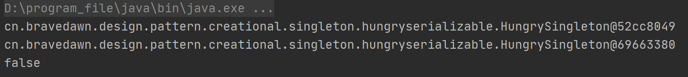

## 第7章 单例模式

### 1. 单例模式讲解

参考博文：https://blog.csdn.net/lovelion/article/details/17517213

* 定义：保证一个类仅有一个实例，并提供一个全局访问点。

* 类型：创建型

* 适用场景：想确保任何情况下都绝对只有一个实例

* 优点：

  1. 在内存中只有一个实例，减少了内存开销
  2. 可以避免对资源的多重占用
  3. 设置全局访问点，严格控制访问

* 缺点：没有接口，扩展困难

* 重点：

  1. 私有构造器

  2. 线程安全

  3. 延迟加载

  4. 序列化和反序列化安全

  5. 反射

  6. Double check

     

     

  7. 静态内部类

     

* 实用技能

  * 反编译
  * 内存原理
  * 多线程debug

* 相关设计模式

  * 单例模式和工厂模式
  * 单例模式和享元模式


### 2. 单例设计模式-懒汉式及多线程Debug实战

#### 1. 普通的懒汉式单例模式

通常发生在多线程环境中，`if (lazySingleton == null)`就会失效，导致可能会有两个线程同时进入，导致重复创建对象的情况。

```java
/**
 * @author : depers
 * @program : design_pattern
 * @description: 懒汉式,线程不安全
 * @date : Created in 2020/9/29 21:29
 */
public class LazySingleton {

    // 1.在类加载时并不自行实例化，这种技术又称为延迟加载(Lazy Load)技术
    // 懒汉式单例在第一次调用getInstance()方法时实例化，在类加载时并不自行实例化，这种技术又称为延迟加载(Lazy Load)技术，即需要的时候再加载实例
    private static LazySingleton lazySingleton = null;

    // 2.禁止外部实例化对象
    private LazySingleton(){

    }

    // 3.提供实例化方法（线程不安全的）
    public static LazySingleton getInstance(){
        if (lazySingleton == null){
            lazySingleton = new LazySingleton(); // 若线程1和线程2都进入到这里，就会存在重复创建对象的情况
        }
        return lazySingleton;
    }
}

```

#### 2.线程安全的懒汉式单例模式

该懒汉式单例类在getInstance()方法前面增加了关键字`synchronized`进行线程锁，以处理多个线程同时访问的问题。但是，上述代码虽然解决了线程安全问题，但是每次调用getInstance()时都需要进行线程锁定判断，**在多线程高并发访问环境中，将会导致系统性能大大降低**。

```java
/**
 * @author : depers
 * @program : design_pattern
 * @description: 懒汉式,线程安全
 * @date : Created in 2020/9/29 21:29
 */
public class LazySingletonSafe {

    // 1.在类加载时并不自行实例化，这种技术又称为延迟加载(Lazy Load)技术
    // 懒汉式单例在第一次调用getInstance()方法时实例化，在类加载时并不自行实例化，这种技术又称为延迟加载(Lazy Load)技术，即需要的时候再加载实例
    private static LazySingletonSafe lazySingleton = null;

    // 2.禁止外部实例化对象
    private LazySingletonSafe(){

    }

    // 3.提供实例化方法（线程安全）
    public synchronized static LazySingletonSafe getInstance(){
        if (lazySingleton == null){
            lazySingleton = new LazySingletonSafe();
        }
        return lazySingleton;
    }

    // 3.提供实例化方法，这个效果与上面相同，都是阻塞整个类
    /*
    public static LazySingletonSafe getInstance(){
        synchronized(LazySingletonSafe.class){
            if (lazySingleton == null){
                lazySingleton = new LazySingletonSafe();
            }
        }
        return lazySingleton;
    }
     */
}
```

#### 3. IDEA多线程Debug

在你需要打断的的地方，设置挂起方式为`Thread`，如下图所示：


* 参考博文：https://blog.csdn.net/lovelion/article/details/7420886

* Git commit：https://github.com/depers/design_pattern/commit/f6fa1a2368b8a577c027fb2667723865894eb439

### 3. 单例设计模式-DoubleCheck双重检查实战及原理解析

* intra-thread semantics 保证重排序不会改变**单线程内**的程序执行结果。

  换句话说，intra-thread semantics 允许那些在单线程内，不会改变单线程程序执行结果的重排序。

* 单线程内重排序不会改变程序的执行结果

  

* 多线程内重排序可能会导致报错

  1. 代码

     ```java
     /**
      * @author : depers
      * @program : design_pattern
      * @description: 懒汉式双重检查单例
      * @date : Created in 2020/10/12 20:29
      */
     public class LazyDoubleCheckSingleton {
     
         // 1.在类加载时并不自行实例化，这种技术又称为延迟加载(Lazy Load)技术
         // 1) 懒汉式单例在第一次调用getInstance()方法时实例化，在类加载时并不自行实例化，这种技术又称为延迟加载(Lazy Load)技术，即需要的时候再加载实例
         private static LazyDoubleCheckSingleton lazyDoubleCheckSingleton = null;
     
         // 2.禁止外部实例化对象
         private LazyDoubleCheckSingleton(){
     
         }
     
         // 3.提供实例化方法（线程不安全的）
         public static LazyDoubleCheckSingleton getInstance(){
             if (lazyDoubleCheckSingleton == null){
                 synchronized (LazyDoubleCheckSingleton.class){
                     if (lazyDoubleCheckSingleton == null){
                         lazyDoubleCheckSingleton = new LazyDoubleCheckSingleton();
                         /**
                          * 上面这句代码实际上进行了三个操作
                          * 1. 分配内存
                          * 2. 初始化对象
                          * 3. 设置lazyDoubleCheckSingleton 指向刚分配的内存地址
                          * 值得注意的是第2步和第3步有可能会发生指令重排，这里在多线程下会导致报错
                          */
                     }
                 }
             }
             return lazyDoubleCheckSingleton;
         }
     }
     ```

  2. 问题

     如下图所示线程0执行到重排序之后的抢先第三步，接着线程1又开始执行首先会判断instance是否为null，然后接着初次访问对象，这个对象是线程0中并未完成初始化的对象。这时就会报错，因为线程0并没有初始化对象，只是设置instance指向了内存空间。

     

  3. 解决方法

     1. **禁止指令重排**。禁止线程0中的第2步和第3步指令进行重排序。

        ```java
        // 1.在类加载时并不自行实例化，这种技术又称为延迟加载(Lazy Load)技术
        // 1) 懒汉式单例在第一次调用getInstance()方法时实例化，在类加载时并不自行实例化，这种技术又称为延迟加载(Lazy Load)技术，即需要的时候再加载实例
        // 2) 使用volatile关键字规避指令重排
        private volatile static LazyDoubleCheckSingleton lazyDoubleCheckSingleton = null;
        ```

     2. **允许指令重排，但是不能允许其他线程看到这个重排序**。也就是允许线程0中的第2步和第3步指令进行重排序，但是不允许线程1看到这个重排序。参见下节的第二点。

### 4. 单例设计模式-静态内部类-基于类初始化的延迟加载解决方案及原理解析

#### 1. 类初始化时机（主动引用）

虚拟机规范中并没有强制约束何时进行加载，但是规范严格规定了有且只有下列五种情况必须对类进行初始化（加载、验证、准备都会随之发生）：

参考博文：[类初始化时机]([https://github.com/CyC2018/CS-Notes/blob/master/notes/Java%20%E8%99%9A%E6%8B%9F%E6%9C%BA.md#%E7%B1%BB%E5%88%9D%E5%A7%8B%E5%8C%96%E6%97%B6%E6%9C%BA](https://github.com/CyC2018/CS-Notes/blob/master/notes/Java 虚拟机.md#类初始化时机))

- 遇到 new、getstatic、putstatic、invokestatic 这四条字节码指令时，如果类没有进行过初始化，则必须先触发其初始化。最常见的生成这 4 条指令的场景是：

  - new：使用 new 关键字实例化对象的时候；
  - getstatic和：读取一个类的静态字段的时候，并且该变量不是常量成员；
  - putstatic：设置一个类的静态字段的时候；
  - invokestatic：调用一个类的静态方法的时候。

#### 2. 静态内部类单例-基于类初始化的延迟加载解决方案

> 解决DoubleCheck双重检查多线程内重排序问题：**允许指令重排，但是不能允许其他线程看到这个重排序**。也就是允许线程0中的第2步和第3步指令进行重排序，但是不允许线程1看到这个重排序。

* 实际步骤

  如下图所示，线程0获得了Class对象的初始化锁，然后去执行类初始化的逻辑（1，3，2），线程1则等待。此时由于对象锁的缘故，线程1是看不到。只有这里巧妙的利用了虚拟机的类初始化机制创建单例。


### 5. 单例设计模式-饿汉式

#### 1.饿汉式单例

**当类被加载时，静态变量hungrySingleton会被初始化**，单例类的唯一实例将被创建。如果使用饿汉式单例来实现负载均衡器LoadBalancer类的设计，则不会出现创建多个单例对象的情况，**可确保单例对象的唯一性**。

```java
/**
 * @author : depers
 * @program : design_pattern
 * @description: 饿汉式单例模式
 * @date : Created in 2020/10/13 21:07
 */
public class HungrySingleton {

    private final static HungrySingleton hungrySingleton;

    static {
        hungrySingleton = new HungrySingleton();
    }

    public static HungrySingleton getInstance(){
        return hungrySingleton;
    }
}
```

#### 2. 饿汉式单例类与懒汉式单例类比较

饿汉式与懒汉式最大的区别就是**延时加载**。

1. 加载时机角度：
   * 饿汉式在类被加载时就将自己实例化
   * 懒汉式在第一次使用时创建，无须一直占用系统资源，实现了延迟加载
2. 资源利用效率角度
   * 饿汉式由于在类加载时该对象就需要创建，利用效率低
   * 懒汉式由于第一次使用时创建，资源利用效率高

### 6. 单例设计模式-序列化破坏单例模式原理解析及解决方案

这里以饿汉模式为例，其他的单例设计类似。从这一节中我们可以看到序列化与反序列化对单例的破坏。

1. 初始代码

   值得注意的是`HungrySingleton`类必须实现`Serializable`接口，不然会报`NotSerializableException`异常。
   
   ```java
   @author : depers
    * @program : design_pattern
    * @description: 应用层
    * @date : Created in 2020/10/13 22:44
    */
   public class Test {
   
   
       public static void main(String[] args) throws IOException, ClassNotFoundException {
           HungrySingleton instance = HungrySingleton.getInstance();
           ObjectOutputStream oos = new ObjectOutputStream(new FileOutputStream("singleton_file"));
           oos.writeObject(instance);
   
           File file = new File("singleton_file");
           ObjectInputStream ois = new ObjectInputStream(new FileInputStream(file));
   
           HungrySingleton newInstance = (HungrySingleton) ois.readObject();
   
           System.out.println(instance);
           System.out.println(newInstance);
           System.out.println(instance == newInstance);
       }
}
   ```

   运行上面的这段程序，结果如下：

   
   
2. 进一步完善

   * 在cn.bravedawn.design.pattern.creational.singleton.hungryserializable.HungrySingleton中添加`readResolve`方法：

     ```java
     private Object readResolve(){
     	return hungrySingleton;
     }
     ```

   * 然后我们在次运行第一小节的代码，结果如下：

     
     
   
3. 原理分析

   第二小节中的改动为什么会导致序列化后的对象与之前的一致呢，下面我们将进行相关代码的分析。

   * java.io.ObjectInputStream#readObject

     ```java
     Object obj = readObject0(false);
     ```

   * java.io.ObjectInputStream#readObject0

     ```java
     case TC_OBJECT:
     	return checkResolve(readOrdinaryObject(unshared));
     ```

   * java.io.ObjectInputStream#readOrdinaryObject

     ```java
     obj = desc.isInstantiable() ? desc.newInstance() : null;
     ```

     这里虽然调用`desc.newInstance()`new了一个新的对象，但这个对象并没有进行返回。

   * java.io.ObjectStreamClass#isInstantiable

     > Returns true if represented class is serializable/externalizable and can be instantiated by the serialization runtime

     这里的意思就是说，如果一个类实现了serializable和externalizable接口并且可以由序列化运行时实例化。就返回true。HungrySingleton实现了Serializable接口所以这里会返回true。

   * java.io.ObjectInputStream#readOrdinaryObject

     ```java
     handles.lookupException(passHandle) == null && desc.hasReadResolveMethod())
     ```

   * java.io.ObjectStreamClass#hasReadResolveMethod

     > Returns true if represented class is serializable or externalizable and defines a conformant readResolve method.  Otherwise, returns false.
     >
     > 如果表示的类是可序列化或可外部化的，则返回true，并定义符合的readResolve方法。否则,返回false。

   * java.io.ObjectInputStream#readOrdinaryObject

     ```java
     Object rep = desc.invokeReadResolve(obj);
     ```

     从方法名上我们就可以看出这里是使用反射返回这个对象。

   * java.io.ObjectStreamClass#invokeReadResolve

     ```
     return readResolveMethod.invoke(obj, (Object[]) null);
     ```

     通过反射调用类的`readResolve`方法。

   * java.io.ObjectStreamClass#ObjectStreamClass(java.lang.Class<?>)

     ```java
     readResolveMethod = getInheritableMethod(cl, "readResolve", null, Object.class);
     ```

   到这里就可以解释第二小节中我们为什么要写`readResolve`方法了。

### 7. 单例设计模式-反射攻击解决方案及原理分析

#### 1. 编写饿汉式反射攻击代码

```java
public static void main(String[] args) throws NoSuchMethodException, IllegalAccessException, InvocationTargetException, InstantiationException {

    Class objectClass = HungrySingleton.class;
    Constructor constructor = objectClass.getDeclaredConstructor();
    // 设置允许访问非public的构造器
    constructor.setAccessible(true);
    HungrySingleton instance = HungrySingleton.getInstance();
    HungrySingleton newInstance = (HungrySingleton) constructor.newInstance();

    System.out.println(instance);
    System.out.println(newInstance);
    System.out.println(instance == newInstance);
}
```

运行结果：


从运行结果来看两次生成的对象都是不同的。

#### 2. 饿汉式反射攻击解决方法

1. 修改cn.bravedawn.design.pattern.creational.singleton.reflect.HungrySingleton的私有无参构造器：

   ```java
   private HungrySingleton(){
   	// 避免反射攻击
       if (hungrySingleton != null) {
       	throw new RuntimeException("单例构造器禁止反射调用");
       }
   }
   ```

2. 再次运行cn.bravedawn.design.pattern.creational.singleton.reflect.Test#main，结果如下：

   

#### 3. 静态内部类单例的反射攻击解决方法

1. 测试代码cn.bravedawn.design.pattern.creational.singleton.reflect.StaticTest#main：

   ```java
   public static void main(String[] args) throws NoSuchMethodException, IllegalAccessException, InvocationTargetException, InstantiationException {
   
       /**
       * 基于静态内部类的单例反射攻击
       */
       Class objectStaticClass = StaticInnerClassSingleton.class;
       Constructor staticConstructor = objectStaticClass.getDeclaredConstructor();
       // 设置允许访问非public的构造器
       staticConstructor.setAccessible(true);
       StaticInnerClassSingleton staticInstance = StaticInnerClassSingleton.getInstance();
       StaticInnerClassSingleton staticNewInstance = (StaticInnerClassSingleton) staticConstructor.newInstance();
   
       System.out.println(staticInstance);
       System.out.println(staticNewInstance);
       System.out.println(staticInstance == staticNewInstance);
   }
   ```

2. 运行结果：

   

   从运行结果来看两次生成的对象也是不同的。

3. 修改cn.bravedawn.design.pattern.creational.singleton.reflect.StaticInnerClassSingleton的私有构造器：

   ```java
   private StaticInnerClassSingleton(){
       // 避免反射攻击
       if (InnerClass.staticInnerClassSingleton != null) {
           throw new RuntimeException("单例构造器禁止反射调用");
       }
   }
   ```

4. 再次运行，结果如下：

   

#### 4. 懒汉式单例的反射攻击

1. 测试代码cn.bravedawn.design.pattern.creational.singleton.reflect.LazyTest#main：

   ```java
   public static void main(String[] args) throws NoSuchMethodException, IllegalAccessException, InvocationTargetException, InstantiationException {
       /**
       * 懒汉式单例反射攻击
       */
       Class objectClass = LazySingleton.class;
       Constructor constructor = objectClass.getDeclaredConstructor();
       // 设置允许访问非public的构造器
       constructor.setAccessible(true);
       LazySingleton instance = LazySingleton.getInstance();
       LazySingleton newInstance = (LazySingleton) constructor.newInstance();
   
       System.out.println(instance);
       System.out.println(newInstance);
       System.out.println(instance == newInstance);
   }
   ```

2. 运行结果：

   

   从运行结果来看两次生成的对象也是不同的。

#### 5. 懒汉式单例的反射攻击的解决方案

**懒汉式单例无法完全规避反射攻击。**

1. 方法一：在私有构造器里面添加实例判断，因为实例化方法和私有构造器调用顺序的原因，还是会导致反射攻击。

   编辑cn.bravedawn.design.pattern.creational.singleton.reflect.LazySingleton#LazySingleton：

   ```java
   // 方法一：在私有构造器里面添加实例判断
   private LazySingleton(){
       // 避免反射攻击
       if (lazySingleton != null) {
           throw new RuntimeException("单例构造器禁止反射调用");
       }
   }
   ```

   运行cn.bravedawn.design.pattern.creational.singleton.reflect.LazyTest#main，其中下面这两句代码的前后执行顺序会有很大的区别：

   ```java
   LazySingleton instance = LazySingleton.getInstance();
   LazySingleton newInstance = (LazySingleton) constructor.newInstance();
   ```

   测试一：instance实例化在newInstance前面，导致cn.bravedawn.design.pattern.creational.singleton.reflect.LazySingleton#lazySingleton对象被抢先实例化，这样可以防止反射攻击。运行结果：

   

   测试二：newInstance实例化在instance前面，此时就会有两个不同的对象被实例化。运行结果如下：

   

2. 方法二：通过添加标识字段规避方法一的问题，进而避免反射攻击。

   ```java
   // 方法二：通过添加标识字段规避方法一的问题，进而避免反射攻击
   private static boolean flag = true;
   
   private LazySingleton(){
       // 避免反射攻击
       if (flag) {
       	flag = false;
       } else{
       	throw new RuntimeException("单例构造器禁止反射调用");
       }
   }
   ```

   测试一：运行cn.bravedawn.design.pattern.creational.singleton.reflect.LazyTest，可以避免反射攻击，结果如下：

   

   测试二：编辑cn.bravedawn.design.pattern.creational.singleton.reflect.LazyReflectTest#main

   ```java
   LazySingleton instance = LazySingleton.getInstance();
   
   // 执行到这里flag的值为false，我们此时修改标识字段flag的值为true
   Field flag = instance.getClass().getDeclaredField("flag");
   flag.setAccessible(true);
   flag.set(instance, true);
   
   LazySingleton newInstance = (LazySingleton) constructor.newInstance();
   ```

   运行结果：

   

   由于我们在程序运行中，利用反射修改了标识字段的值，导致懒汉式单例还是无法规避反射攻击。

### 8. 单例设计模式-Enum枚举单例、原理源码解析以及反编译实战

#### 1.编写枚举单例

该单例是《Efficient Java》这本书中的推荐写法，因为**枚举定义的每个实例都是引用类型的唯一实例**，所以枚举单例不会存在线程不安全的问题。代码如下：

```java
/**
 * @author : depers
 * @program : design_pattern
 * @description: 枚举实例
 * @date : Created in 2020/10/15 20:34
 */
public enum EnumInstance {

    INSTANCE;

    private Object data;

    public Object getData() {
        return data;
    }

    public void setData(Object data) {
        this.data = data;
    }

    public static EnumInstance getInstance(){
        return INSTANCE;
    }
}
```

#### 2. 测试枚举单例是否会被序列化破坏

1. 测试一：测试枚举INSTANCE是否会被序列化破坏，答案是不会

   代码：

   ```java
   public static void main(String[] args) throws IOException, ClassNotFoundException {
   
       EnumInstance instance = EnumInstance.getInstance();
       ObjectOutputStream oos = new ObjectOutputStream(new FileOutputStream("singleton_file"));
       oos.writeObject(instance);
   
       File file = new File("singleton_file");
       ObjectInputStream ois = new ObjectInputStream(new FileInputStream(file));
       EnumInstance newInstance = (EnumInstance) ois.readObject();
   
   
       System.out.println(instance);
       System.out.println(newInstance);
       System.out.println(instance == newInstance);
   }
   ```

   结果：

   

2. 测试二：测试枚举INSTANCE的data属性是否会被序列化破坏，答案是不会

   代码：

   ```java
   public static void main(String[] args) throws IOException, ClassNotFoundException {
       /**
       * 测试枚举INSTANCE的data属性是否会被序列化破坏
       */
   
       EnumInstance instance = EnumInstance.getInstance();
       instance.setData(new Object());
   
       ObjectOutputStream oos = new ObjectOutputStream(new FileOutputStream("singleton_file"));
       oos.writeObject(instance);
   
       File file = new File("singleton_file");
       ObjectInputStream ois = new ObjectInputStream(new FileInputStream(file));
       EnumInstance newInstance = (EnumInstance) ois.readObject();
   
   
       System.out.println(instance.getData());
       System.out.println(newInstance.getData());
       System.out.println(instance.getData() == newInstance.getData());
   }
   ```

   结果：

   

   下面我们看一下源码，看一看为什么枚举就不受序列化破坏的影响呢？

   * java.io.ObjectInputStream#readObject

     ```java
     Object obj = readObject0(false);
     ```

   * java.io.ObjectInputStream#readObject0

     ```java
     case TC_ENUM:
     	return checkResolve(readEnum(unshared));
     ```

   * java.io.ObjectInputStream#readEnum

     ```java
     // 获取枚举对象的名称
     String name = readString(false);
     Enum<?> result = null;
     Class<?> cl = desc.forClass();
     if (cl != null) {
         try {
             @SuppressWarnings("unchecked")
             // 枚举对象名称是唯一的，通过名称获取唯一的枚举常量
             Enum<?> en = Enum.valueOf((Class)cl, name);
     ```

     从这里可以看出，通过`Enum.valueOf`可以根据名称获取枚举类中定义的常量值（要求字符串跟枚举的常量名必须一致），这样就**没有创建新的常量对象，维持了这个对象的单例属性**。

#### 3. 测试枚举单例是否会被反射攻击

代码如下，其中两处报错`java.lang.NoSuchMethodException`和`java.lang.IllegalArgumentException: Cannot reflectively create enum objects`值得注意。事实证明枚举单例是不会被反射攻击的。

   ```java
public static void main(String[] args) throws NoSuchMethodException, IllegalAccessException, InvocationTargetException, InstantiationException {

    /**
       * 饿汉式单例反射攻击测试
       */
    Class objectClass = EnumInstance.class;

    // 这里会报: java.lang.NoSuchMethodException，原因是枚举没有无参构造器
    // Constructor constructor = objectClass.getDeclaredConstructor();

    // 这里调用Enum的有参构造器java.lang.Enum.Enum
    Constructor constructor = objectClass.getDeclaredConstructor(String.class, int.class);

    // 设置允许访问非public的构造器
    constructor.setAccessible(true);

    EnumInstance instance = EnumInstance.getInstance();
    // 这里会报: java.lang.IllegalArgumentException: Cannot reflectively create enum objects
    // 也就是说不能使用反射创建枚举对象，所以就不能进行反射攻击
    EnumInstance newInstance = (EnumInstance) constructor.newInstance("fengxiao", 666);

    System.out.println(instance);
    System.out.println(newInstance);
    System.out.println(instance == newInstance);
}
   ```

#### 4. 反编译枚举单例

#### 5. 拓展：枚举实例方法