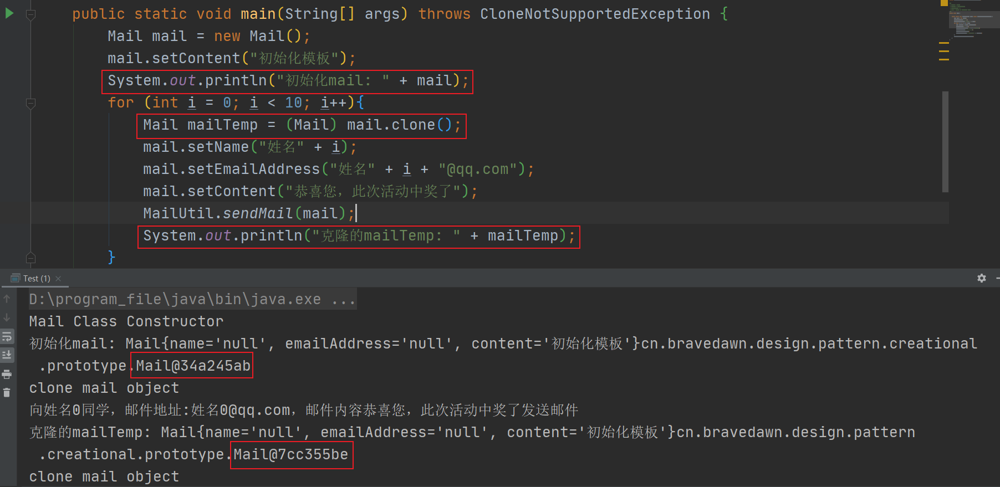
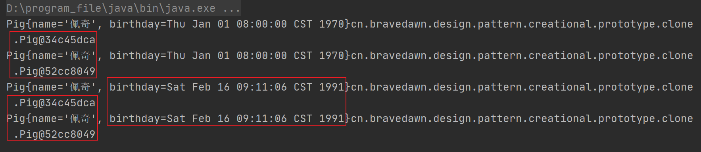
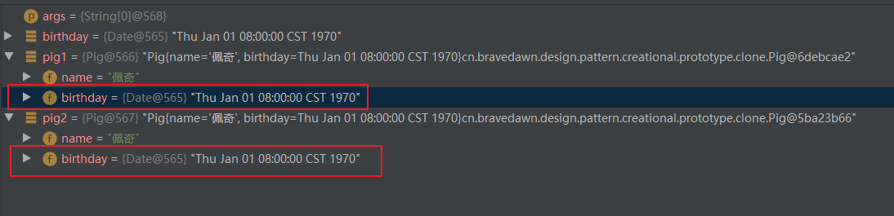
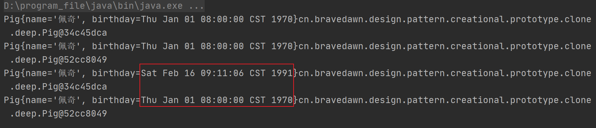
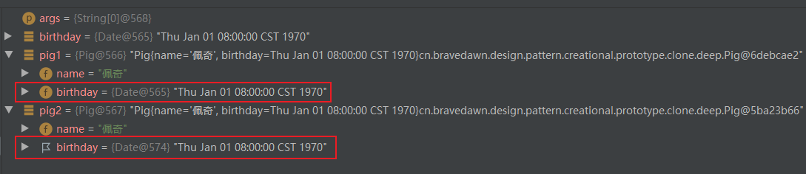
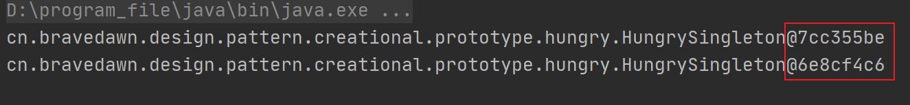
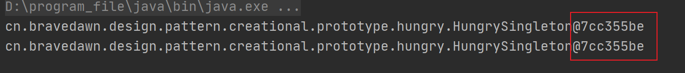

## 第8章 原型模式

### 1.原型模式讲解

* 定义：指原型实例指定创建对象的种类，并且通过拷贝这些原型创建新的对象

* 特点：不需要知道任何创建的细节，不调用构造函数

* 类型：创建型

* 使用场景

  1. 类初始化消耗较多资源
  2. new产生的一个对象需要非常繁琐的过程（数据准备、访问权限等）
  3. 构造函数比较复杂
  4. 循环体中产生大量对象时

* 优点

  1. 原型模式性能比直接new一个对象性能高
  2. 简化创建过程

* 缺点

  1. 必须配备克隆方法
  2. 对克隆复杂对象或对克隆出的对象进行复杂改造时，容易引入风险
  3. 深拷贝、浅拷贝要运用得当

* 拓展

  1. 深克隆

      在深克隆中，无论原型对象的成员变量是值类型还是引用类型，都将复制一份给克隆对象，深克隆将原型对象的所有引用对象也复制一份给克隆对象。简单来说，在深克隆中，除了对象本身被复制外，对象所包含的所有成员变量也将复制。

  2. 浅克隆

     在浅克隆中，如果原型对象的成员变量是值类型，将复制一份给克隆对象；如果原型对象的成员变量是引用类型，则将引用对象的地址复制一份给克隆对象，也就是说**原型对象和克隆对象的成员变量指向相同的内存地址**。简单来说，在浅克隆中，当对象被复制时只复制它本身和其中包含的值类型的成员变量，而引用类型的成员对象并没有复制。

### 2.原型模式coding

#### 1. 原型模式的简单实现

* 要点

  1. 原型模式是在内存中进行二进制流的拷贝，比直接new一个对象的性能好很多。
  2. 克隆的时候不会再调用对象的构造方法。

* 步骤

  * 实现`Cloneable`接口
  * 覆写`clone`方法

* 代码：cn.bravedawn.design.pattern.creational.prototype.v1

* 运行结果

  可以发现初始化的对象和下面每次for循环的对象都不一样。

  

#### 2. 通过抽象类实现原型模式

* 代码：cn.bravedawn.design.pattern.creational.prototype.abstractprototype
* 原理：A实现了克隆方法，B继承了A，B自然就有了克隆的功能。B实例的克隆方法实际上会调用A覆写的克隆方法。

#### 3. 深克隆和浅克隆

* 浅克隆

  代码：cn.bravedawn.design.pattern.creational.prototype.clone.shallow

  测试代码分析

  ```java
  public class Test {
  
      public static void main(String[] args) throws CloneNotSupportedException {
          Date birthday = new Date(0L);
          Pig pig1 = new Pig("佩奇", birthday);
          Pig pig2 = (Pig) pig1.clone();
  
          System.out.println(pig1);
          System.out.println(pig2);
  		// 重置生日
          pig1.getBirthday().setTime(666666666666L);
  
          System.out.println(pig1);
          System.out.println(pig2);
      }
  }
  ```

  运行结果，我们可以看到两个实例的生日是一致的，两个实例也是一致的：

  

  debug之后的结果，你可以发现这两个实例的生日引用是一样的，对pig1做出的修改，pig2也是同步的：

  

* 深克隆

  代码：cn.bravedawn.design.pattern.creational.prototype.clone.deep

  覆写Clone方法：

  ```java
  @Override
  protected Object clone() throws CloneNotSupportedException {
      Pig pig = (Pig) super.clone();
  
      // 深克隆
      pig.birthday = (Date) pig.getBirthday().clone();
      return pig;
  }
  ```

  运行结果：

  

  debug结果，你可以发现这两个实例的生日引用是不一样的：

  

### 3. 原型模式coding-克隆破坏单例

代码：cn.bravedawn.design.pattern.creational.prototype.hungry

1. `HungrySingleton`实现`Cloneable`，覆写`clone`方法

   ```java
   @Override
   protected Object clone() throws CloneNotSupportedException {
   	return super.clone();
   }
   ```

2. 编写测试类：

   ```java
   public static void main(String[] args) throws NoSuchMethodException, InvocationTargetException, IllegalAccessException {
       HungrySingleton hungrySingleton = HungrySingleton.getInstance();
       Method method = hungrySingleton.getClass().getDeclaredMethod("clone");
       method.setAccessible(true);
       HungrySingleton cloneHungrySingleton = (HungrySingleton) method.invoke(hungrySingleton);
       System.out.println(hungrySingleton);
       System.out.println(cloneHungrySingleton);
   }
   ```

3. 运行结果，可以看到克隆方法破坏了单例，生成了两个不同的实例：

   

4. 解决办法就是修改`clone`方法，如下：

   ```java
   @Override
   protected Object clone() throws CloneNotSupportedException {
   	return getInstance();
   }
   ```

5. 运行结果：

   

### 4. 原型模式源码解析

#### 1. JDK

1. java.util.ArrayList

   该类实现了`Cloneable`接口

   * java.util.ArrayList#clone

2. java.util.HashMap

   该类实现了`Cloneable`接口

   * java.util.HashMap#clone

#### 2. Mybatis

1. org.apache.ibatis.cache.CacheKey

   该类实现了`Cloneable`接口

   * org.apache.ibatis.cache.CacheKey#clone