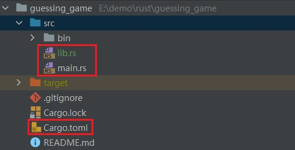

# 第七章 使用包、Crate和模块管理不断增长的项目

Created: September 27, 2021 12:15 PM
Created by: Anonymous
Last edited time: October 14, 2021 11:57 AM

# Rust的模块系统

Rust的模块系统包括：

- **包**（*Packages*）： Cargo 的一个功能，它允许你构建、测试和分享 crate。
- **Crates** ：一个模块的树形结构，它形成了库或二进制项目。
- **模块**（*Modules*）和 **use**： 允许你控制作用域和路径的私有性。
- **路径**（*path*）：一个命名例如结构体、函数或模块等项的方式

# 7.1 包和crate

## 包和crate

### 1. 定义

包（package） 是提供一系列功能的一个或者多个 crate。一个包会包含有一个 Cargo.toml 文件，阐述如何去构建这些 crate。

crate 是一个二进制项或者库。crate root 是一个源文件，Rust 编译器以它为起始点，并构成你的 crate 的根模块

### 2. 规则内容

1. 一个包中至多 只能 包含一个**库 crate**(library crate)；
2. 包中可以包含任意多个**二进制 crate**(binary crate)；
3. 包中至少包含一个 crate，无论是库的还是二进制的;

### 3. Cargo 遵循的一个约定

在下面这个目录结构中：

- src/main.rs 就是一个与包同名的二进制 crate 的 crate 根
- Cargo 知道如果包目录中包含 src/lib.rs，则包带有与其同名的库 crate，且 src/lib.rs也是库的 crate 根
- crate 根文件将由 Cargo 传递给 rustc 来实际构建库或者二进制项目。
- 通过将文件放在 src/bin 目录下，一个包可以拥有多个二进制 crate：每个 src/bin 下的文件都会被编译成一个独立的二进制 crate。

在下面这个包中，同时含有 src/main.rs 和 src/lib.rs，则它有两个 crate：一个库和一个二进制项，且名字都与包相同。



# 7.2 定义模块来控制作用域与私有性

## 模块的定义和作用

模块 让我们可以将一个 crate 中的代码进行分组，以提高可读性与重用性（**代码导航**）。

模块还可以控制项的 私有性，即项是可以被外部代码使用的（public），还是作为一个内部实现的内容，不能被外部代码使用（private）。

## 模块的实践

通过执行`cargo new --lib restaurant`，来创建一个新的名为 `restaurant` 的库。

在`restaurant`中的src/lib文件中定义一个**模块**，是以 `mod` 关键字为起始，然后指定模块的名字（本例中叫做 front_of_house），并且用花括号包围模块的主体。

在模块内，我们还可以定义其他的模块，就像本例中的 hosting 和 serving 模块。模块还可以保存一些定义的其他项，比如结构体、枚举、常量、特性、或者函数。

```rust
mod front_of_house {
    mod hosting {
        fn add_to_waitlist() {}

        fn seat_at_table() {}
    }

    mod serving {
        fn take_order() {}

        fn server_order() {}

        fn take_payment() {}
    }
}
```

## 模块树

src/main.rs 和 src/lib.rs 叫做 crate 根。所以这样叫它们是因为这两个文件的内容都分别在 crate 模块结构的根组成了一个名为 crate 的模块，该结构被称为 **模块树**（module tree），模块树展示了一些模块是如何被嵌入到另一个模块的。`restaurant` 库的模块树结构。

```rust
crate
 └── front_of_house
     ├── hosting
     │   ├── add_to_waitlist
     │   └── seat_at_table
     └── serving
         ├── take_order
         ├── serve_order
         └── take_payment
```

# 7.3 路径用于引用模块树中的项

## 绝对路径和相对路径

路径有两种形式，绝对路径和相对路径都后跟一个或多个由**双冒号（::）分割**的标识符：

- **绝对路径**（*absolute path*）从 crate 根开始，以 crate 名或者字面值 `crate` 开头。
- **相对路径**（*relative path*）从当前模块开始，以 `self`、`super` 或当前模块的标识符开头。

### 1. 实践

使用绝对路径和相对路径来调用 add_to_waitlist 函数。

```rust
mod front_of_house {
    mod hosting {
        fn add_to_waitlist() {}
    }
}

pub fn eat_at_restaurant() {
    // Absolute path
    crate::front_of_house::hosting::add_to_waitlist();

    // Relative path
    front_of_house::hosting::add_to_waitlist();
}
```

- 第一种方式：因为模块`front_of_house`和函数`eat_at_restaurantcrate`被定义在同一crate中，这意味着我们可以使用 `crate`关键字为起始的**绝对路径**。
- 第二种方式：因为模块`front_of_house`和函数`eat_at_restaurantcrate`定义在该crate的同一层级，所以可以通过`front_of_house` 开始的**相对路径**来访问到add_to_waitlist。

### 2. Rust的私有性边界

<aside>
💡 上面的那段代码编译时不通过的。因为add_to_waitlist函数默认是私有的。

</aside>

**Rust 的 私有性边界**（privacy boundary）：这条界线不允许外部代码了解、调用和依赖被封装的实现细节。所以，如果你希望创建一个私有函数或结构体，你可以将其放入模块。

Rust 中默认所有项（函数、方法、结构体、枚举、模块和常量）都是私有的。

父模块中的项不能使用子模块中的私有项，但是子模块中的项可以使用他们父模块中的项。这是因为子模块封装并隐藏了他们的实现详情，但是子模块可以看到他们定义的上下文。

### 3. 使用 pub 关键字暴露路径

pub关键字的作用：

1. 为**模块（mod）**添加pub关键字：模块上的 pub 关键字只允许其父模块引用它。
2. 私有性规则不但应用于**模块**，还应用于**结构体**、**枚举**、**函数**和**方法**。

一个例子：

```rust
mod front_of_house {
    pub mod hosting {
        pub fn add_to_waitlist() {}
    }
}

pub fn eat_at_restaurant() {
    // Absolute path
    crate::front_of_house::hosting::add_to_waitlist();

    // Relative path
    front_of_house::hosting::add_to_waitlist();
}
```

上面的这段代码是可以正常编译通过的：

- `front_of_house` 模块：crate 根中定义了 `front_of_house` 模块。`front_of_house` 模块不是公有的，不过因为 `eat_at_restaurant` 函数与 `front_of_house` **定义于同一模块中（即，`eat_at_restaurant` 和 `front_of_house` 是兄弟）**，我们可以从 `eat_at_restaurant` 中引用 `front_of_house`。
- `hosting`模块。因为我们可以访问 `hosting` 的父模块，所以可以访问 `hosting`。
- `add_to_waitlist` 函数：它被标记为 `pub` ，我们可以访问其父模块，所以这个函数调用是有效的。

### 4. 使用 super 起始的相对路径

super关键字的作用类似于文件系统中以 `..` 开头的语法。作用是如果我们要重新组织这个 crate 的模块树，需要一起移动它们。因此，我们使用 `super`，这样一来，如果这些代码被移动到了其他模块，我们只需要更新很少的代码。

```rust
mod front_of_house {
    pub mod hosting {
        pub fn add_to_waitlist() {}

        fn seat_at_table() {}
    }

    pub mod serving {
        fn take_order() {}

        pub fn server_order() {}

        fn take_payment() {}
    }
}

mod back_of_house {
    fn fix_incorrect_order() {
        cook_order();
        super::front_of_house::serving::server_order();
    }

    fn cook_order() {}
}
```

## 创建公有的结构体和枚举

### 1. 结构体

创建公有的结构体注意点：

1. 一个结构体定义的前面使用了 `pub` ，这个结构体会变成公有的，但是这个**结构体的字段仍然是私有的**。在下面的例子中，其中有一个公有字段 toast 和私有字段 seasonal_fruit。
2. 我们可以在 `eat_at_restaurant` 方法中使用**点号**来随意的读写 `toast` 字段。
3. 我们不能在 `eat_at_restaurant` 中使用 `seasonal_fruit`字段，因为 `seasonal_fruit` 是私有的。
4. 因为 `back_of_house::Breakfast` 具有私有字段，所以这个结构体需要提供一个**公共的关联函数**来构造 `Breakfast`的实例(这里我们命名为 `summer`)。如果不提供这个公共的关联函数，无法在 eat_at_restaurant 中创建 Breakfast 实例，因为我们无法在`eat_at_restaurant`设置`Breakfast`私有属性`seasonal_fruit`的值

```rust
mod back_of_house {

    pub struct Breakfast {
        pub toast: String,
        seasonal_fruit: String,
    }

    impl Breakfast {
        pub fn summer(toast: &str) -> Breakfast {
            Breakfast {
                toast: String::from(toast),
                seasonal_fruit: String::from("peaches"),
            }
        }
    }
}

fn eat_at_restaurant() {

    let mut meal = back_of_house::Breakfast::summer("Rye");
    meal.toast = String::from("Wheat");
    println!("I'd like {} toast please", meal.toast);
}
```

### 2. 枚举

与结构体不同的是，如果我们将**枚举设为公有**，则它的**所有成员都将变为公有**。我们只需要在 `enum`关键字前面加上 `pub` 。

```rust
mod back_of_house {

    pub enum Appetizer {
        Soup,
        Salad,
    }
}

fn eat_at_restaurant() {
    let order1 = back_of_house::Appetizer::Salad;
    let order2 = back_of_house::Appetizer::Soup;
}
```

# 7.4 使用 use 关键字将名称引入作用域

`use`关键字的作用：调用函数的路径都很冗长且重复，并不方便。

`use`关键字的功能：使用 use 关键字将路径一次性引入作用域，然后调用该路径中的项，就如同它们是本地项一样。

## 创建惯用的 use 路径

这里有几个惯用的规则：

1. **将外部函数引入作用域**：只须使用use将函数的父模块引入作用域，我们在使用外部函数时，通过其父模块调用函数，就可以清晰的区分函数是不是本地定义的了
  
    ```rust
    mod front_of_house {
        pub mod hosting {
            pub fn add_to_waitlist() {}
        }
    }
    
    use front_of_house::hosting;
    
    pub fn eat_at_restaurant() {
        hosting::add_to_waitlist();
        hosting::add_to_waitlist();
        hosting::add_to_waitlist();
    }
    ```
    
2. **使用`use`引入结构体、枚举和其他项时**：下面展示了将结构体HashMap引入二进制crate作用域的习惯用法。
  
    ```rust
    use std::collections::HashMap;
    
    fn main() {
        let mut map = HashMap::new();
        map.insert(1, 2);
    }
    ```
    
3. **将两个同名类型引入同一作用域（第一种解决方法）**：将相同名称类型项的父模块使用use引入，在使用的时候通过模块可以区分这个不同的类型。
  
    ```rust
    use std::fmt;
    use std::io;
    
    fn function1() -> fmt::Result {
        // --snip--
    }
    
    fn function2() -> io::Result<()> {
        // --snip--
    }
    ```
    
    ## 使用as关键字提供新的名称
    
    使用use将两个同名类型引入同一作用域的第二个解决办法：**在这个类型的路径后面，我们使用 `as`指定一个新的本地名称或者别名。**
    
    ```rust
    use std::fmt::Result;
    use std::io::Result as IoResult;
    
    fn function1() -> Result {
        // --snip--
        Ok(())
    }
    
    fn function2() -> IoResult<()> {
        // --snip--
        Ok(())
    }
    ```
    
    ## 使用 pub use 重导出名称
    
    这个知识点应该是这一节中最让人想不通的功能了。
    
    这个功能的意思就是说`re_exporting`模块使用`use`关键字将`front_of_house`的`hosting`模块引入了作用域，对于`re_exporting`模块来讲，hosting模块是其私有的，不能供`re_exporting`模块的引用方（调用方）去使用。
    
    `re_exporting`模块使用`pub use`关键字将`front_of_house`的`serving`模块引入了作用域，对于`re_exporting`模块来讲，`serving`模块并不是其私有的，就像serving模块作为`re_exporting`模块子模块，也可以供`re_exporting`的引用方（调用方）去使用。
    
    **也就是说通过`pub use`关键字，我们可以将当前作用域的功能传递给上层的调用者，从而实现共享功能到任何代码的作用域中。**
    
    ```rust
    mod front_of_house {
        pub mod hosting {
            pub fn add_to_waitlist() {}
    
            fn seat_at_table() {}
        }
    
        pub mod serving {
            fn take_order() {}
    
            pub fn server_order() {}
    
            fn take_payment() {}
        }
    }
    
    pub mod back_of_house {
        fn fix_incorrect_order() {
            cook_order();
            super::front_of_house::serving::server_order();
        }
    
        pub fn cook_order() {}
    
        pub struct Breakfast {
            pub toast: String,
            seasonal_fruit: String,
        }
    
        impl Breakfast {
            pub fn summer(toast: &str) -> Breakfast {
                Breakfast {
                    toast: String::from(toast),
                    seasonal_fruit: String::from("peaches"),
                }
            }
        }
    
        pub enum Appetizer {
            Soup,
            Salad,
        }
    }
    
    // 重点是下面这段代码-------------------------------------------------
    mod re_exporting {
    
        use crate::front_of_house::hosting;
        pub use crate::front_of_house::serving;
        pub use crate::back_of_house;
    
        pub fn hello() {
            hosting::add_to_waitlist();
        }
    }
    
    fn test_re_exporting() {
    
        use re_exporting;
    
        re_exporting::hello();
    
        // 因为在模块re_exporting中我没有使用pub use重导出hosting模块，所以在模块re_exporting的调用者调用时会报private module import，
        // 因为此时hosting模块在re_exporting作用域中是私有的，要想在re_exporting的调用者中使用hosting模块，应要在re_exporting中将hosting模块重导出
        // re_exporting::hosting::add_to_waitlist();
    
        re_exporting::serving::server_order();
    
        // 这个还有一个小坑，back_of_host对于re_exporting是同级模块可以直接引入，但是对于重导出的back_of_host他其实是re_exporting的子模块，所以必须使其声明为公有的
        re_exporting::back_of_house::cook_order();
    
    }
    ```
    

## 使用外部包

### 1. 使用[crates.io](http://crates.io/)的外部包

1. 在Cargo.toml 中加入依赖项，以rand为例
  
    ```java
    [dependencies]
    rand = "0.5.5"
    ```
    
2. 将 rand 定义引入项目包的作用域
  
    ```java
    use rand::Rng;
    
    fn main() {
        let secret_number = rand::thread_rng().gen_range(1, 101);
    }
    ```
    

### 2. 使用Rust的标准库

注意标准库（std）对于你的包来说也是外部 crate。因为标准库随 Rust 语言一同分发，无需修改 Cargo.toml 来引入 std。具体使用如下：

```java
use std::collections::HashMap;
```

## 嵌套路径来消除大量的 use 行

### 第一个例子：

```rust
use std::cmp::Ordering;
use std::io;
```

这个我们可以写成：

```rust
se std::{cmp::Ordering, io};
```

### 第二个例子：

```rust
use std::io;
use std::io::Write;
```

这个我们可以写成：

```rust
use std::io::{self, Write};
```

## 通过 glob 运算符将所有的公有定义引入作用域

将一个路径下 所有 公有项引入作用域，可以指定路径后跟`*`，glob 运算符：

```rust
use std::collections::*;
```

使用场景：glob 运算符经常用于测试模块 tests 中。

缺点：往往难以推导作用域中有什么名称和它们是在何处定义的。

# 7.5 将模块分割进不同文件

在之前对模块的学习中，我们在二级制crate和库crate的例子中，在一个main.rs或是lib.rs中定义多个模块。当模块变得更多更复杂时，我们可以将模块的定义移动到单独的文件中去，进而是的代码更易阅读。

将模块分割为不同的文件适用于**库crate 根文件是 src/lib.rs**的，这也同样适用于**以 src/main.rs 为 crate 根文件的二进制 crate 项**。

下面我们以**库crate 根文件是 src/lib.rs**的模块分割为例：

1. 通过执行`cargo new --lib restaurant2`，来创建一个新的名为 `restaurant2` 的库。
2. 在restaurant2/src/[lib.rs](http://lib.rs)文件定义模块并将模块引入作用域：
  
    ```rust
    mod front_of_house;
    
    pub use crate::front_of_house::hosting;
    
    pub fn eat_at_restaurant() {
        hosting::add_to_waitlist();
        hosting::add_to_waitlist();
        hosting::add_to_waitlist();
    }
    ```
    
3. 新建文件在restaurant2/src/front_of_house.rs定义模块
  
    ```rust
    pub mod hosting;
    ```
    
4. 创建文件夹在restaurant2/src/front_of_house并新添加一个文件hosting.rs，其内容如下：
  
    ```rust
    pub fn add_to_waitlist() {
        println!("被调用了！！！")
    }
    ```
    
5. 在项目的Cargo.toml文件中引入库restaurant2的依赖
  
    ```rust
    [dependencies]
    restaurant2 = {path = "./restaurant2"}
    ```
    
6. 在项目的src/main.rs中调用库的相关方法
  
    ```rust
    use restaurant2::eat_at_restaurant;
    use restaurant2::hosting::add_to_waitlist;
    
    fn main() {
        eat_at_restaurant();
        println!("--------------");
        add_to_waitlist();
    }
    ```
    
    控制台输出：
    
    ```rust
    被调用了！！！
    被调用了！！！
    被调用了！！！
    --------------
    被调用了！！！
    ```
    

## Reference

[rust学习--将模块分成不同的文件](https://segmentfault.com/a/1190000023580446)