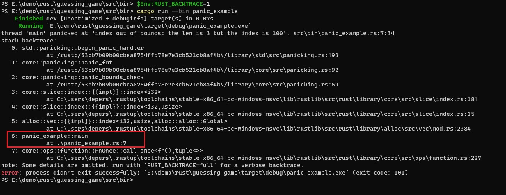

# 第九章 错误处理

Created: October 30, 2021 11:18 AM
Created by: Anonymous
Last edited time: December 3, 2021 10:34 PM

Rust的错误处理有两个类别：

- 可恢复错误（*recoverable*）：可恢复错误通常代表向用户报告错误和重试操作是合理的情况，比如未找到文件。
- 不可恢复错误（*unrecoverable*）：就是程序出bug了，比如数组访问越界

总结：

- `panic!` 宏代表一个程序无法处理的状态，并停止执行而不是使用无效或不正确的值继续处理。
- Rust 类型系统的 `Result` 枚举代表操作可能会在一种可以恢复的情况下失败。可以使用 `Result` 来告诉代码调用者他需要处理潜在的成功或失败。在适当的场景使用 `panic!` 和 `Result` 将会使你的代码在面对不可避免的错误时显得更加可靠。

# 9.1 panic!与不可恢复的错误

## 对应panic时的栈展开或终止

- 栈展开：当出现 panic 时，程序默认会开始 **展开**（*unwinding*），这意味着 Rust 会回溯栈并清理它遇到的每一个函数的数据，不过这个回溯并清理的过程有很多工作。也就是说Rsut自己会去做程序内存的清理工作。
- 栈终止：当出现panic时，这会不清理数据就退出程序。那么程序所使用的内存需要由操作系统来清理。这样做的好处就是程序的最终二进制文件会比较小。
  
    可以在*Cargo.toml* 的 `[profile]` 部分增加 `panic = 'abort'`：
    
    ```rust
    [profile.release]
    panic = 'abort'
    ```
    

## backtrace

backtrace就是可以打印出出现错误的堆栈信息。

在windows下可以设置环境变量，比如在terminal（cmd）中执行：`set RUST_BACKTRACE=1` ，如果是powershell的话执行：`$Env:RUST_BACKTRACE=1` 。

执行下面的这段程序：`cargo run --bin panic_example`

```rust
fn main() {
    let a = vec![1, 2, 3];

    println!("a index 100 = {}", a[100]);
}
```

打印输出：



从回溯中可以看出，是我编写的panic_example的第7行出错了。

# 9.2 Result与可恢复的错误

使用Result类型的错误处理。`Result<T, E>`是用于返回和传播错误的类型。它是一个枚举，其中`Ok(T)`代表成功并包含一值，`Err(E)`代表错误并包含错误值。

可恢复的错误：大部分错误并没有严重到需要程序完全停止执行，我们可以捕获该错误并加以处理。

## 匹配不同的错误

1. 不匹配错误直接报错
  
    ```rust
    fn open_file() {
        let f = File::open("hello.txt");
        let f = match f {
            Ok(file) => file,
            Err(error) => {
                panic!("Problem opening the file: {:?}", error);
            }
        };
    }
    ```
    
    打印输出：
    
    ```rust
    thread 'main' panicked at 'Problem opening the file: Os { code: 2, kind: NotFound, message: "系统找不到指定的文件。" }', src\bin\panic_example.rs:20:13
    stack backtrace:
       0: std::panicking::begin_panic_handler
                 at /rustc/53cb7b09b00cbea8754ffb78e7e3cb521cb8af4b\/library\std\src\panicking.rs:493
       1: std::panicking::begin_panic_fmt
                 at /rustc/53cb7b09b00cbea8754ffb78e7e3cb521cb8af4b\/library\std\src\panicking.rs:435
       2: panic_example::open_file
                 at .\src\bin\panic_example.rs:20
       3: panic_example::main
                 at .\src\bin\panic_example.rs:5
       4: core::ops::function::FnOnce::call_once<fn(),tuple<>>
                 at C:\Users\depers\.rustup\toolchains\stable-x86_64-pc-windows-msvc\lib\rustlib\src\rust\library\core\src\ops\function.rs:227
    ```
    
2. 匹配错误
  
    优化上面的错误，根据不同的错误进行处理。如果没有该文件，则创建该文件。下面这段程序还可以使用`unwrap_or_else` 重写，这个后面学到再说。
    
    ```rust
    fn handle_open_file_error() {
        let f = File::open("hello.txt");
        let f = match f {
            Ok(file) => file,
            Err(error) => match error.kind() {
                ErrorKind::NotFound => match File::create("hello.txt") {
                    Ok(fc) => fc,
                    Err(e) => panic!("Problem creating the file: {:?}", e)
                },
                other_error => panic!("Problem opening the file: {:?}", other_error)
            }
        };
    }
    ```
    

## 失败时 panic 的简写：unwrap 和 expect

### 1. unwrap

`Result<T, E>` 类型定义使用`match`处理过于繁琐，我们可以使用`unwrap`简化调用。如果 `Result` 值是成员 `Ok`，`unwrap` 会返回 `Ok` 中的值。如果 `Result` 是成员 `Err`，`unwrap` 会为我们调用 `panic!`。

```rust
use std::fs::File;

fn main() {
    let f = File::open("hello.txt").unwrap();
}
```

结果输出：

```rust
thread 'main' panicked at 'called `Result::unwrap()` on an `Err` value: Error {
repr: Os { code: 2, message: "No such file or directory" } }',
src/libcore/result.rs:906:4
```

### 2. expect

允许我们定制 `panic!` 的错误信息：`expect` 。这样针对于不同的错误，我们可以及时定位出错的代码。

```rust
use std::fs::File;

fn main() {
    let f = File::open("hello.txt").expect("Failed to open hello.txt");
}
```

结果输出：

```rust
thread 'main' panicked at 'Failed to open hello.txt: Error { repr: Os { code:
2, message: "No such file or directory" } }', src/libcore/result.rs:906:4
```

## 传播错误

将异常抛给该函数的调用者，这个操作称为 **传播错误**。

```rust
fn propagate_error() {
    let s = read_username_from_file();
    match s {
        Ok(s) => println!("username={}", s),
        Err(e) => println!("error={:?}", e)
    }
}

fn read_username_from_file() -> Result<String, io::Error>{
    let f = File::open("hello.txt");

    let mut f = match f {
        Ok(file) => file,
        Err(e) => return Err(e)
    };

    let mut s = String::new();
    match f.read_to_string(&mut s) {
        Ok(_) => Ok(s),
        Err(e) => Err(e)
    }

}
```

打印输出：

```rust
error=Os { code: 2, kind: NotFound, message: "系统找不到指定的文件。" }
```

## 传播错误的简写：? 运算符

### 1. ？运算符的使用

`?`运算符，可以在可能抛出错误的地方将错误传播出去，消除了大量样板代码并使得函数的实现更简单。比如上面的代码，我们使用`?`运算符之后，代码就变成了下面这样：

```rust
fn propagate_error_question_mark() {
    let s = read_username_from_file_with_question();
    match s {
        Ok(s) => println!("username={}", s),
        Err(e) => println!("error={:?}", e)
    }
}

fn read_username_from_file_with_question() -> Result<String, io::Error>{
    let mut f = File::open("hello.txt")?;
    let mut s = String::new();
    f.read_to_string(&mut s)?;
    Ok(s)
}
```

输出结果：

```rust
error=Os { code: 2, kind: NotFound, message: "系统找不到指定的文件。" }
```

### 2. 问号运算符之后的链式方法调用

在使用问号运算符的同时，我们还可以进行链式的调用。

```rust
fn propagate_error_question_mark_chained() {
    let s = read_username_from_file_with_question_chained();
    match s {
        Ok(s) => println!("username={}", s),
        Err(e) => println!("error={:?}", e)
    }
}

fn read_username_from_file_with_question_chained() -> Result<String, io::Error>{
    let mut s = String::new();
    File::open("hello.txt")?.read_to_string(&mut s)?;
    Ok(s)
}
```

除了上面对错误传播的演示，其实从文件中读取字符串还有一个更短的调用api：

```rust
fn propagate_error_shorter() {
    let s = read_string_from_file_shorter();
    match s {
        Ok(s) => println!("username={}", s),
        Err(e) => println!("error={:?}", e)
    }
}

fn read_string_from_file_shorter() -> Result<String, io::Error>{
    fs::read_to_string("hello.txt")
}
```

运行结果：

```rust
error=Os { code: 2, kind: NotFound, message: "系统找不到指定的文件。" }
```

## ? 运算符可被用于返回 Result 的函数

**核心知识点**：`?` 运算符可被用于返回 Result 的函数

运行下面这段程序：

```rust
fn main() {
    let f = File::open("hello.txt")?;
}
```

输出：

```rust
error[E0277]: the `?` operator can only be used in a function that returns `Result` or `Option` (or another type that implements `Try`)
 --> src\bin\panic_example.rs:8:13
  |
7 | / fn main() {
8 | |     let f = File::open("hello.txt")?;
  | |             ^^^^^^^^^^^^^^^^^^^^^^^^ cannot use the `?` operator in a function that returns `()`
```

上面这段程序有两个知识点：

1. main函数的返回值类型是`()`
2. 只能在返回 `Result` 或者其它实现了 `std::ops::Try` 的类型的函数中使用 `?` 运算符

如果你想在不返回Result类型的函数中使用了其他返回Result类型的函数，并用?运算符。修复这种问题的方法有两种：

- 第一种：将函数返回值类型修改为 `Result<T, E>` ，如果没有其它限制阻止你这么做的话
- 第二种：通过合适的方法使用 `match` 或 `Result` 的方法之一来处理 `Result<T, E>`

这里我们通过第一种方法修改main函数：

```rust
fn main() -> Result<(), Box<dyn Error>> {
    let f = File::open("hello.txt")?;
    Ok(())
}
```

解析：

1. `main` 函数是特殊的，其必须返回什么类型是有限制的。`main` 函数的一个有效的返回值是 `()` ，所以Result的第一个有效返回值是`()`
2. 同时出于方便，第二个有效的返回值是 `Result<T, E>` ，也就是`Box<dyn Error>`。目前可以理解 `Box<dyn Error>` 为使用 `?` 时 `main` 允许返回的 “任何类型的错误”。

# 9.3 panic!还是不panic!

## panic的使用场景

- 在编写示例，代码原型和测试的时候都非常适合使用panic
- 在我们还没有准备好处理错误之前，使用unwrap和expect方法在原型设计的时候也是非常方便的
- 在测试代码的时候，我们希望测试失败，这里使用unwrap和expect方法也是合适的

## 错误处理的指导原则

1. 这个和Java中的异常一个道理，Exception和Error就像是Panic，而RuntimeException就像是Result，当然这个类比不是很合适。
2. 代码中对值的校验，比如Java中就有许多判断null的操作。在Rust中，如果你没有使用 `Option` 的类型，那么这个变量一定是有值的。所以Rust的函数在运行时无需判空。

## 创建自定义类型进行有效性验证

首先我们回顾一下之前的猜数字游戏的代码，下面这个是第一版代码：

```rust
fn guess_num() {
    println!("Guess the number!");

    let secret_number = rand::thread_rng().gen_range(1..101);

    println!("The secret number is: {}", secret_number);

    loop {
        println!("Please input your guess.");

        let mut guess = String::new();
        io::stdin().read_line(&mut guess)
            .expect("Failed to read line");

        let guess:u32 = match guess.trim().parse() {
            Ok(num) => num,
            Err(_) => continue,
        };

        println!("You guessed: {}", guess);

        match guess.cmp(&secret_number) {
            Ordering::Less => println!("Too small!"),
            Ordering::Greater => println!("Too big!"),
            Ordering::Equal => {
                println!("You win!");
                break;
            }
        }
    }

}
```

如果这我们对所猜的数字进行自定义类型，这样我们就可以在声明这个变量的时候对用户输入的值进行有效性验证了，这样可以避免在使用这个值的函数中频繁的去校验值的合法性：

```rust
use std::cmp::Ordering;
use std::io;
use rand::Rng;

pub struct Guess {
    value: i32,
}

impl Guess {

    pub fn new(value: i32) -> Guess {
        if value < 1 || value > 100 {
            panic!("Guess value must be between 1 and 100, got {}.", value)
        }

        Guess {
            value
        }
    }

    pub fn value(&self) -> i32{
        self.value
    }
}

fn guess_num() {
    println!("Guess the number!");

    let secret_number = rand::thread_rng().gen_range(1..101);

    println!("The secret number is: {}", secret_number);

    loop {
        println!("Please input your guess.");

        let mut guess_str = String::new();
        io::stdin().read_line(&mut guess_str)
            .expect("Failed to read line");

        let guess = match guess_str.trim().parse() {
            Ok(num) => Guess::new(num),
            Err(_) => continue,
        };

        println!("You guessed: {}", guess.value);

        match guess.value.cmp(&secret_number) {
            Ordering::Less => println!("Too small!"),
            Ordering::Greater => println!("Too big!"),
            Ordering::Equal => {
                println!("You win!");
                break;
            }
        }
    }

}

fn main() {
    guess_num();
}
```

运行结果，这里如果我输入-1，程序直接会报出一个不可恢复的错误：

```rust
Please input your guess.
-1
thread 'main' panicked at 'Guess value must be between 1 and 100, got -1.', src\bin\Guess.rs:14:13
```