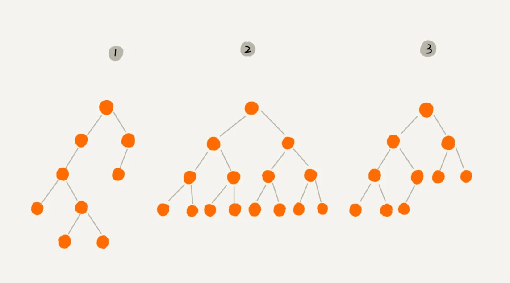

# 树

# 预备知识

## 树的属性

- 树是分层的
- 除根节点外，一个节点的所有子节点独立于另一个节点的子节点
- 叶子节点时唯一的

## 树的基本特征

- 节点
- 根
- 边
- 路径
- 子节点
- 父节点
- 叶子节点
- 兄弟节点
- 深度
- 高度
- 层数
- 树高

下面两张图介绍了高度、深度、层数和树的高度之间的定义和区别：

## 定义

1. 树具有一个根节点。
2. 除根节点外， 每个节点通过其他节点的边互相连接父和子节点（ 若有） 。
3. 从根遍历到任何节点的路径全局唯一。

## 树的表示（存储）

- 基于数组的顺序存储
  
    访问元素过于复杂，且会浪费空间
    
- 基于链表的链式存储
  
    非常直观，不用嵌套，元素访问方便
    

# 二叉树

## 定义

在二叉树中，每个节点至多只有两棵子树（二叉树不存在度大于2的节点），并且二叉树有左右之分，其次序不能颠倒。

## 特殊的二叉树

- 满二叉树
  
    叶子节点全都在最底层，除了叶子节点之外，每个节点都有左右两个子节点。
    
- 完全二叉树
  
    叶子节点都在最底下两层，最后一层的叶子节点都靠左排列，并且除了最后一层，其他层的节点个数都要达到最大。

## 二叉树的遍历

