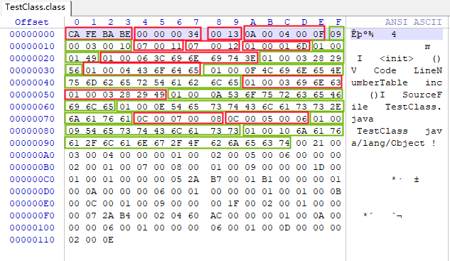

# TestClass.class文件的分析

## 用十六进制编辑器打开二进制文本展示



## javap -v TestClass.class文件输出

```
PS E:\Note\读书笔记\《深入理解Java虚拟机》> javap -v .\TestClass.class
Classfile /E:/Note/读书笔记/《深入理解Java虚拟机》/TestClass.class
  Last modified 2022-10-26; size 275 bytes
  MD5 checksum c287135973ee287548a00413f187a523
  Compiled from "TestClass.java"
public class TestClass
  minor version: 0
  major version: 52
  flags: ACC_PUBLIC, ACC_SUPER
Constant pool:
   #1 = Methodref          #4.#15         // java/lang/Object."<init>":()V
   #2 = Fieldref           #3.#16         // TestClass.m:I
   #3 = Class              #17            // TestClass
   #4 = Class              #18            // java/lang/Object
   #5 = Utf8               m
   #6 = Utf8               I
   #7 = Utf8               <init>
   #8 = Utf8               ()V
   #9 = Utf8               Code
  #10 = Utf8               LineNumberTable
  #11 = Utf8               inc
  #12 = Utf8               ()I
  #13 = Utf8               SourceFile
  #14 = Utf8               TestClass.java
  #15 = NameAndType        #7:#8          // "<init>":()V
  #16 = NameAndType        #5:#6          // m:I
  #17 = Utf8               TestClass
  #18 = Utf8               java/lang/Object
{
  public TestClass();
    descriptor: ()V
    flags: ACC_PUBLIC
    Code:
      stack=1, locals=1, args_size=1
         0: aload_0
         1: invokespecial #1                  // Method java/lang/Object."<init>":()V
         4: return
      LineNumberTable:
        line 1: 0

  public int inc();
    descriptor: ()I
    flags: ACC_PUBLIC
    Code:
      stack=2, locals=1, args_size=1
         0: aload_0
         1: getfield      #2                  // Field m:I
         4: iconst_1
         5: iadd
         6: ireturn
      LineNumberTable:
        line 6: 0
}
SourceFile: "TestClass.java"
```

## 分析

* CAFEBABE：魔数
* 