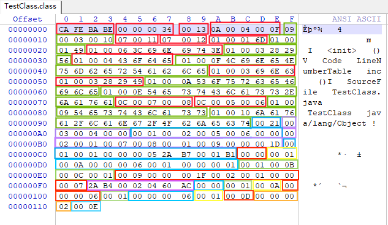

# TestClass.class类文件结构的分析

## 用十六进制编辑器打开二进制文本展示

TestClass.java源码：

```java
public class TestClass {

    private int m;

    public int inc() {
        return m + 1;
    }
}
```

使用十六进制编辑器打开TestClass.class文件：



## javap -v TestClass.class文件输出

`javap-v`命令用于**以详细模式（verbose）显示类的字节码和其他相关信息**。

```
PS E:\Note\读书笔记\《深入理解Java虚拟机》> javap -v .\TestClass.class
Classfile /E:/Note/读书笔记/《深入理解Java虚拟机》/TestClass.class
  Last modified 2022-10-26; size 275 bytes
  MD5 checksum c287135973ee287548a00413f187a523
  Compiled from "TestClass.java"
public class TestClass
  minor version: 0
  major version: 52
  flags: ACC_PUBLIC, ACC_SUPER
Constant pool:
   #1 = Methodref          #4.#15         // java/lang/Object."<init>":()V
   #2 = Fieldref           #3.#16         // TestClass.m:I
   #3 = Class              #17            // TestClass
   #4 = Class              #18            // java/lang/Object
   #5 = Utf8               m
   #6 = Utf8               I
   #7 = Utf8               <init>
   #8 = Utf8               ()V
   #9 = Utf8               Code
  #10 = Utf8               LineNumberTable
  #11 = Utf8               inc
  #12 = Utf8               ()I
  #13 = Utf8               SourceFile
  #14 = Utf8               TestClass.java
  #15 = NameAndType        #7:#8          // "<init>":()V
  #16 = NameAndType        #5:#6          // m:I
  #17 = Utf8               TestClass
  #18 = Utf8               java/lang/Object
{
  public TestClass();
    descriptor: ()V
    flags: ACC_PUBLIC
    Code:
      stack=1, locals=1, args_size=1
         0: aload_0
         1: invokespecial #1                  // Method java/lang/Object."<init>":()V
         4: return
      LineNumberTable:
        line 1: 0

  public int inc();
    descriptor: ()I
    flags: ACC_PUBLIC
    Code:
      stack=2, locals=1, args_size=1
         0: aload_0
         1: getfield      #2                  // Field m:I
         4: iconst_1
         5: iadd
         6: ireturn
      LineNumberTable:
        line 6: 0
}
SourceFile: "TestClass.java"
```

## 分析

### 魔数

1. `CA FE BA BE`：魔数

### Class文件的版本

1. `00 00 00 34`：十进制数是52，也就是**JDK1.8**。说明这个文件可以被JDK1.8或是以上版本虚拟机执行的Class文件。

### 常量池

1. `00 13`：即十进制19，常量池容量计数值。代表常量池中有19项常量。可以看到javap输出的文件内容中，Constant pool中一共有18项常量定义。在常量池中0索引项是预留项。
4. `0A 00 04 00 0F`：常量池第1项，CONSTANT_Methodref_info类型。

   * `0A`：即十进制10，CONSTANT_Methodref_info类型的标志位。
   * `00 04`：指向声明方法的类描述符CONSTANT_Class_info的索引项，这里指向常量池第4项。
   * `00 0F`：指向名称及类型描述符CONSTANT_NameAndType的索引项，这里指向常量池第15项。
5. `09 00 03 00 10`：常量池第2项，CONSTANT_Fieldref_info类型。

   * `09`：即十进制9，CONSTANT_Fieldref_info类型的标志位。
   * `00 03`：指向声明字段的类或者接口描述符CONSTANT_Class_info的索引项，这里指向常量池第3项。
   * `00 10`：指向字段描述符CONSTANT_NameAndType的索引项，这里指向常量池第16项。
6. `07 00 11`：常量池第3项，CONSTANT_Class_info类型。

   * `07`：即十进制7，CONSTANT_Class_info类型的标志位。
   * `00 11`：指向全限定名常量项CONSTANT_Utf8_info的索引项，这里指向常量池第17项。
7. `07 00 12`：常量池第4项，CONSTANT_Class_info类型。

   * `07`：即十进制7，CONSTANT_Class_info类型的标志位。

   * `00 12`：指向全限定名常量项CONSTANT_Utf8_info的索引项，这里指向常量池第18项。
8. `01 00 01 6D`：常量池第5项，CONSTANT_Utf8_info类型。

   * `01`：即十进制1，CONSTANT_Utf8_info类型的标志位。
   * `00 01`：UTF-8编码的字符串占用的字节数。这里表示1个字节。
   * `6D`：0x6D，在**ASCII表**表中解释为：小写字母`m`。
9. `01 00 01 49`：常量池第6项，CONSTANT_Utf8_info类型。

   * `01`：即十进制1，CONSTANT_Utf8_info类型的标志位。
   * `00 01`：UTF-8编码的字符串占用的字节数。这里表示1个字节。
   * `49`：0x49，在**ASCII表**表中解释为：大写字母`I`。
10. `01 00 06 3C 69 6E 69 74 3E`：常量池第7项，CONSTANT_Utf8_info类型。

    * `01`：即十进制1，CONSTANT_Utf8_info类型的标志位。
    * `00 06`：UTF-8编码的字符串占用的字节数。这里表示6个字节。
    * `3C 69 6E 69 74 3E`
      * `3C`，对应**ASCII表**表中解释为：小于号`<`
      * `69`，对应**ASCII表**表中解释为：小写字母`i`
      * `6E`，对应**ASCII表**表中解释为：小写字母`n`
      * `69`，对应**ASCII表**表中解释为：小写字母`i`
      * `74`，对应**ASCII表**表中解释为：小写字母`t`
      * `3E`，对应**ASCII表**表中解释为：大于号`>`
11. `01 00 03 28 29 56`：常量池第8项，CONSTANT_Utf8_info类型。

    * `01`：即十进制1，CONSTANT_Utf8_info类型的标志位。
    * `00 03`：UTF-8编码的字符串占用的字节数。这里表示3个字节。
    * `28 29 56`
      * `28`：对应**ASCII表**表中解释为：开括号`(`
      * `29`：对应**ASCII表**表中解释为：闭括号`)`
      * `56`：对应**ASCII表**表中解释为：大写字母`V`
12. `01 00 04 43 6F 64 65`：常量池第9项，CONSTANT_Utf8_info类型。

    * `01`：即十进制1，CONSTANT_Utf8_info类型的标志位。
    * `00 04`：UTF-8编码的字符串占用的字节数。这里表示4个字节。
    * `43 6F 64 65`
      1. `43`：对应**ASCII表**表中解释为：大写字母`C`
      2. `6F`：对应**ASCII表**表中解释为：小写字母`o`
      3. `64`：对应**ASCII表**表中解释为：小写字母`d`
      4. `65`：对应**ASCII表**表中解释为：小写字母`e`
13. `01 00 0F 4C 69 6E 65 4E 75 6D 62 65 72 54 61 62 6C 65 `：常量池第10项，CONSTANT_Utf8_info类型。

    * `01`：即十进制1，CONSTANT_Utf8_info类型的标志位。
    * `00 0F`：UTF-8编码的字符串占用的字节数。这里表示15个字节。
    * `4C 69 6E 65 4E 75 6D 62 65 72 54 61 62 6C 65`
      1. `4C`：对应**ASCII表**表中解释为：大写字母`L`
      2. `69`：对应**ASCII表**表中解释为：小写字母`i`
      3. `6E`：对应**ASCII表**表中解释为：小写字母`n`
      4. `65`：对应**ASCII表**表中解释为：小写字母`e`
      5. `4E`：对应**ASCII表**表中解释为：大写字母`N`
      6. `75`：对应**ASCII表**表中解释为：小写字母`u`
      7. `6D`：对应**ASCII表**表中解释为：小写字母`m`
      8. `62`：对应**ASCII表**表中解释为：小写字母`b`
      9. `65`：对应**ASCII表**表中解释为：小写字母`e`
      10. `72`：对应**ASCII表**表中解释为：小写字母`r`
      11. `54`：对应**ASCII表**表中解释为：大写字母`T`
      12. `61`：对应**ASCII表**表中解释为：小写字母`a`
      13. `62`：对应**ASCII表**表中解释为：小写字母`b`
      14. `6C`：对应**ASCII表**表中解释为：小写字母`l`
      15. `65`：对应**ASCII表**表中解释为：小写字母`e`
14. `01 00 03 69 6E 63`：常量池第11项，CONSTANT_Utf8_info类型。

    * `01`：即十进制1，CONSTANT_Utf8_info类型的标志位。
    * `00 03`：UTF-8编码的字符串占用的字节数。这里表示3个字节。
    * `69 6E 63`
      1. `69`：对应**ASCII表**表中解释为：小写字母`i`
      2. `6E`：对应**ASCII表**表中解释为：小写字母`n`
      3. `63`：对应**ASCII表**表中解释为：小写字母`c`
15. `01 00 03 28 29 49`：常量池第12项，CONSTANT_Utf8_info类型。

    * `01`：即十进制1，CONSTANT_Utf8_info类型的标志位。
    * `00 03`：UTF-8编码的字符串占用的字节数。这里表示3个字节。
    * `28 29 49`
      1. `28`：对应**ASCII表**表中解释为：开括号`(`
      2. `29`：对应**ASCII表**表中解释为：闭括号`)`
      3. `49`：对应**ASCII表**表中解释为：大写字母`I`
16. `01 00 0A 53 6F 75 72 63 65 46 69 6C 65`：常量池第13项，CONSTANT_Utf8_info类型。

    * `01`：即十进制1，CONSTANT_Utf8_info类型的标志位。
    * `00 0A`：UTF-8编码的字符串占用的字节数。这里表示10个字节。
    * `53 6F 75 72 63 65 46 69 6C 65`
      1. `53`：对应**ASCII表**表中解释为：大写字母`S`
      2. `6F`：对应**ASCII表**表中解释为：小写字母`o`
      3. `75`：对应**ASCII表**表中解释为：小写字母`u`
      4. `72`：对应**ASCII表**表中解释为：小写字母`r`
      5. `63`：对应**ASCII表**表中解释为：小写字母`c`
      6. `65`：对应**ASCII表**表中解释为：小写字母`e`
      7. `46`：对应**ASCII表**表中解释为：大写字母`F`
      8. `69`：对应**ASCII表**表中解释为：小写字母`i`
      9. `6C`：对应**ASCII表**表中解释为：小写字母`l`
      10. `65`：对应**ASCII表**表中解释为：小写字母`e`
17. `01 00 0E 54 65 73 74 43 6C 61 73 73 2E 6A 61 76 61`：常量池第14项，CONSTANT_Utf8_info类型。
    * `01`：即十进制1，CONSTANT_Utf8_info类型的标志位。
    * `00 0E`：UTF-8编码的字符串占用的字节数。这里表示14个字节。
    * `54 65 73 74 43 6C 61 73 73 2E 6A 61 76 61`
      1. `54`：对应**ASCII表**表中解释为：大写字母`T`
      2. `65`：对应**ASCII表**表中解释为：小写字母`e`
      3. `73`：对应**ASCII表**表中解释为：小写字母`s`
      4. `74`：对应**ASCII表**表中解释为：小写字母`t`
      5. `43`：对应**ASCII表**表中解释为：大写字母`C`
      6. `6C`：对应**ASCII表**表中解释为：小写字母`l`
      7. `61`：对应**ASCII表**表中解释为：小写字母`a`
      8. `73`：对应**ASCII表**表中解释为：小写字母`s`
      9. `73`：对应**ASCII表**表中解释为：小写字母`s`
      10. `2E`：对应**ASCII表**表中解释为：句号`.`
      11. `6A`：对应**ASCII表**表中解释为：小写字母`j`
      12. `61`：对应**ASCII表**表中解释为：小写字母`a`
      13. `76`：对应**ASCII表**表中解释为：小写字母`v`
      14. `61`：对应**ASCII表**表中解释为：小写字母`a`
18. `0C 00 07 00 08`：常量池第15项，CONSTANT_NameAndType_info类型。
    * `0C`：即十进制12，CONSTANT_NameAndType_info类型的标志位。
    * `00 07`：指向该字段或方法名称常量项CONSTANT_Utf8_info类型的索引，这里指向常量池第7项。。
    * `00 08`：指向该字段或方法描述符常量项CONSTANT_Utf8_info类型的索引，这里指向常量池第8项。
19. `0C 00 05 00 06`：常量池第16项，CONSTANT_NameAndType_info类型。

    * `0C`：即十进制12，CONSTANT_NameAndType_info类型的标志位。
    * `00 05`：指向该字段或方法名称常量项CONSTANT_Utf8_info类型的索引，这里指向常量池第5项。。
    * `00 06`：指向该字段或方法描述符常量项CONSTANT_Utf8_info类型的索引，这里指向常量池第6项。

18. `01 00 09 54 65 73 74 43 6C 61 73 73`：常量池第17项，CONSTANT_Utf8_info类型。
    * `01`：即十进制1，CONSTANT_Utf8_info类型的标志位。
    * `00 09`：UTF-8编码的字符串占用的字节数。这里表示9个字节。
    * `54 65 73 74 43 6C 61 73 73`
      1. `54`：对应**ASCII表**表中解释为：大写字母`T`
      2. `65`：对应**ASCII表**表中解释为：小写字母`e`
      3. `73`：对应**ASCII表**表中解释为：小写字母`s`
      4. `74`：对应**ASCII表**表中解释为：小写字母`t`
      5. `43`：对应**ASCII表**表中解释为：大写字母`C`
      6. `6C`：对应**ASCII表**表中解释为：小写字母`l`
      7. `61`：对应**ASCII表**表中解释为：小写字母`a`
      8. `73`：对应**ASCII表**表中解释为：小写字母`s`
      9. `73`：对应**ASCII表**表中解释为：小写字母`s`
19. `01 00 10 6A 61 76 61 2F 6C 61 6E 67 2F 4F 62 6A 65 63 74`：常量池第18项，CONSTANT_Utf8_info类型。
    * `01`：即十进制1，CONSTANT_Utf8_info类型的标志位。
    * `00 10`：UTF-8编码的字符串占用的字节数。这里表示16个字节。
    * `6A 61 76 61 2F 6C 61 6E 67 2F 4F 62 6A 65 63 74`
      1. `6A`：对应**ASCII表**表中解释为：小写字母`j`
      2. `61`：对应**ASCII表**表中解释为：小写字母`a`
      3. `76`：对应**ASCII表**表中解释为：小写字母`v`
      4. `61`：对应**ASCII表**表中解释为：小写字母`a`
      5. `2F`：对应**ASCII表**表中解释为：斜杠`/`
      6. `6C`：对应**ASCII表**表中解释为：小写字母`l`
      7. `61`：对应**ASCII表**表中解释为：小写字母`a`
      8. `6E`：对应**ASCII表**表中解释为：小写字母`n`
      9. `67`：对应**ASCII表**表中解释为：小写字母`g`
      10. `2F`：对应**ASCII表**表中解释为：斜杠`/`
      11. `4F`：对应**ASCII表**表中解释为：大写字母`O`
      12. `62`：对应**ASCII表**表中解释为：小写字母`b`
      13. `6A`：对应**ASCII表**表中解释为：小写字母`j`
      14. `65`：对应**ASCII表**表中解释为：小写字母`e`
      15. `63`：对应**ASCII表**表中解释为：小写字母`c`
      16. `74`：对应**ASCII表**表中解释为：小写字母`t`

### 访问标志

1. `00 21`：访问标志，这个类是支持的访问标识是ACC_PUBLIC和ACC_SUPER，所以access_flags的计算值为：0x0001|0x0020=0x0021。

### 类索引

1. `00 03`：类名，指向常量池中的索引值为3的CONSTANT_Class_info类型的常量，通过该类型常量的索引值可以找到他的类型为CONSTANT_Utf8_info常量的全限定名字符串，也就是`TestClass`。

### 父类索引

1. `00 04`：父类的全限定名。指向常量池中的索引值为4的CONSTANT_Class_info类型的常量，通过该类型常量的索引值可以找到他的类型为CONSTANT_Utf8_info常量的全限定名字符串，也就是`java.lang.Object`。

### 接口索引集合

1. `00 00`：实现接口的数量，这里没有实现接口所以计数器值为0。

### 字段表集合

1. `00 01`：第一个u2类型的数据为**字段表集合的容量计数器**，fields_count。这里表示这个类只声明了一个字段表数据，也就是说这个类只有一个字段。
2. `00 02`：**字段访问标志**，因为这个字段是private的，所以标志名称为ACC_PRIVATE的字段，它的标志值是0x0002。
3. `00 05`：**字段的简单名称**，是指向常量池中索引值类型为5的CONSTANT_Utf8_info常量，也就是`m`。
4. `00 06`：**字段的描述符**，用来描述字段的数据类型。是指向常量池中索引值类型为**6**的CONSTANT_Utf8_info常量，也就是`I`，含义是`int`类型。
4. `00 00`：**字段的属性表计数器**，这里为0，说明该字段没有自己的属性。

### 方法表集合

1. `00 02`：第一个u2类型的数据为**方法表集合的容量计数器**，methods_count。这里代表集合有两个方法，分别是编译器添加的实例构造器`<init>`和源码中的方法`inc()`。

#### 第一个方法

1. `00 01`：第一个方法的**字段访问标志**，值为0x0001，也就是只有ACC_PUBLIC标志为真，也就是说这个方法是public修饰的。
2. `00 07`：**方法名称**，是指向常量池中索引值为7的CONSTANT_Utf8_info常量，也就是方法名为：`<init>`，也就是编译器自动为我们生成的无参构造器方法。
3. `00 08`：**方法的描述符**，是指向常量池中索引值类型为8的CONSTANT_Utf8_info常量，也就是：`()V`，也就是没有方法入参，方法返回值是`void`。
4. `00 01`：**方法的属性表计数器**，attributes_count的值为1，表示此方法的属性集合表中有一项属性。

##### 属性表集合

1. `00 09`：属性名称索引，是指向常量池中索引值为9的CONSTANT_Utf8_info常量，属性名称是：`Code`。
2. `00 00 00 1D`：属性值长度，这里的长度是29。这个长度是排除了**属性名称索引**和**属性值长度**的。
3. `00 01`：操作数栈深度的最大值为1，虚拟机运行时需要根据这个这个值来分配栈帧。
4. `00 01`：局部变量所需的存储空间，这里是1 Shot。这里的1个shot保存的是实例方法中的隐藏参数this。
5. `00 00 00 05`：字节码长度，这里为5个字节。
6. `2A B7 00 01 B1`：字节码指令
    * `0x2a`：aload_0，将第一个引用类型本地变量推送至栈顶。
    * `0xb7`：invokespecial，调用超类构建方法，实例初始化方法，私有方法。
    * `0x00`：nop，什么都不做。
    * `0x01`：aconst_null，将null推送至栈顶
    * `0xb1`：return，从当前方法返回`void`
7. `00 00`：异常处理表的长度是0
8. `00 01`：**附属属性**的数量是1个
9. `00 0A`：属性名称索引，是指向常量池中索引值为10的CONSTANT_Utf8_info常量，属性名称是：`LineNumberTable`。
10. `00 00 00 06`：属性值长度，这里的长度是6
11. `00 01`：类型为line_number_info的集合数量为1
12. `00 00 00 01`：line_numer_info表，具体的结构内容如下：
     * `00 00`：`start_pc`数据项，字节码指令的偏移量（单位：字节），即该指令在`Code`属性的`code[]`数组中的索引位置。例如，`start_pc=0`表示方法的第一条指令。
     * `00 01`：`line_number`数据项，对应的Java源代码行号（从1开始计数）。
     * 也就是说start_pc为0就是`0x2a`：aload_0指令，对应Java源码中的`public class TestClass {`第1行代码。

#### 第二个方法

1. `00 01`：第一个方法的**字段访问标志**，值为0x0001，也就是只有ACC_PUBLIC标志为真，也就是说这个方法是public修饰的。
2. `00 0B`：**方法名称**，是指向常量池中索引值为11的CONSTANT_Utf8_info常量，也就是方法名为：`inc`，也就是我们自定义的方法。
3. `00 0C`：**方法的描述符**，是指向常量池中索引值为12的CONSTANT_Utf8_info常量，也就是：`()I`，也就是没有方法入参，方法返回值是`int`。
4. `00 01`：**方法的属性表计数器**，attributes_count的值为1，表示此方法的属性集合表中有一项属性。

##### 属性表集合

1. `00 09`：属性名称索引，是指向常量池中索引值为9的CONSTANT_Utf8_info常量，属性名称是：`Code`。
2. `00 00 00 1F`：属性值长度，这里的长度是31。这个长度是排除了**属性名称索引**和**属性值长度**的。
3. `00 01`：操作数栈深度的最大值为2。
4. `00 01`：局部变量所需的存储空间，这里是1 Shot。这里的1个shot保存的是实例方法中的隐藏参数this。
5. `00 00 00 07`：字节码长度，这里为7个字节。
6. `2A B4 00 02 04 60 AC`：字节码指令
    * `0x2A`：aload_0，将第一个引用类型本地变量推送至栈顶。
    * `0xB4`：getfield，获取指定类的实例域，并将其值压入栈顶。
    * `0x00`：nop，什么都不做。
    * `0x02`：iconst_m1，将int型-1推送至栈顶。
    * `0x04`：iconst_1，将int型1推送至栈顶。
    * `0x60`：iadd，将栈顶两个int型数值相加并将结果压入栈顶。
    * `0xAC`：ireturn，从当前方法返回int。
7. `00 00`：异常处理表的长度是0
8. `00 01`：**附属属性**的数量是1个
9. `00 0A`：属性名称索引，是指向常量池中索引值为10的CONSTANT_Utf8_info常量，属性名称是：`LineNumberTable`。
10. `00 00 00 06`：属性值长度，这里的长度是6
11. `00 01`：类型为line_number_info的集合数量为1
12. `00 00 00 06`：line_numer_info表，具体的结构内容如下：
    * `00 00`：`start_pc`数据项，字节码指令的偏移量（单位：字节），即该指令在`Code`属性的`code[]`数组中的索引位置。例如，`start_pc=0`表示方法的第一条指令。
    * `00 06`：`line_number`数据项，对应的Java源代码行号（从1开始计数）。
    * 也就是说start_pc为0就是`0x2A`：aload_0指令，对应Java源码中的`return m + 1;`第6行代码。

### Class文件属性表集合

1. `00 01`：**Class文件的属性表计数器**，attributes_count的值为1，表示Class文件的属性集合表中有一项属性。
2. `00 0D`：属性名称索引，是指向常量池中索引值为13的CONSTANT_Utf8_info常量，属性名称是：`SourceFile`。
3. `00 00 00 02`：属性长度，这里是2。
4. `00 0E`：源码文件的文件名索引，指向常量池中索引值为14的CONSTANT_Utf8_info常量，源码文件的文件名为`TestClass.java`。
