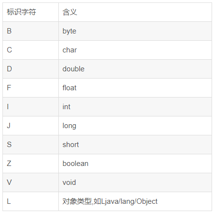

# 第6章 类文件结构

> 2022年10月5日 陕西西安《深入理解Java虚拟机》p162-p167

## 6.2 无关性的基石

* 语言无关性：Java虚拟机上可以支持其他语言运行在JVM上。

* 平台无关性：一次编译，到处运行。

* 字节码：
  1. 是不同JVM和不同平台都统一使用的一种程序存储格式。
  2. Java语言中的各种常量、关键字和运算符号的语义最终都是由多条字节码命令组成的。

## 6.3 Class类文件的结构

* Class文件是一组以8位字节为基础单位的二进制流。

* Big-Endian：是一种字节存储顺序，简称 **高位在前** 或 **大尾序** 或 **大端序**。具体是指最高位字节在地址的最低位，最低位字节在地址最高位，按照这样的顺序来存储数据。

  如下图所示，对于多字节数据，如整数（32位机中一般占4字节），在不同的处理器的存放方式主要有两种，以内存中0x0A0B0C0D的存放方式为例。0x0A是最高字节，他存储在最低的内存地址a处。

  

  关于这个问题可以参考：https://zh.wikipedia.org/wiki/%E5%AD%97%E8%8A%82%E5%BA%8F

* Class文件采用类似C语言结构体的伪结构存储数据，伪结构包含两种数据类型：**无符号数**和**表**。
* 无符号数：基本数据类型，以u1，u2，u4，u8分别来表示1个字节、2个字节、4个字节和8个字节的无符号数。
* 表：由多个无符号数或其他表作为数据项构成的复合数据类型。

### 6.3.1 魔数和Class文件的版本

* 魔数：Class文件的头4个字节称为魔数。
* 魔数的作用：确定这个文件是否为一个能被虚拟机接受的Class文件。
* Class文件的版本号：紧接着魔数后面的4个字节存储的是Class文件的版本号。第5到6个字节是次版本号，第7到8个字节是主版本号。
* Class文件版本号的作用：确定虚拟机是否可以执行该版本号的Class文件，例如一个Class文件的主版本号是0x0032，十进制是50，50对应JDK 1.6.0_01，也就是说这个Class文件可以被1.6.0_01或以上版本的虚拟机执行。

### 6.3.2 常量池

> 2022年10月10日 陕西西安 第六章 类文件结构 p168-p172页内容的学习

* 常量池的特点
  1. 常量池是Class文件中第一个出现的表类型数据项目。
  2. 常量池的每一项常量都是一个表。
  3. 常量池的第一项是一个u2类型的数据，代表常量池容量计数值（constant_pool_count）。该容器计数（常量池的索引）是从1开始的不是0。0作为预留值，代表“不引用任何一个常量池项目”的含义。
* 常量池存放的两大常量
  * 字面量
  * 符号引用
    * 类和接口的全限定名（Full Qualified Name）
    * 字段的名称和描述符（Descriptor）
    * 方法的名称和描述符
* 常量池的项目类型
  * JDK1.7共有14项项目类型。
  * 14项项目类型都有一个共同的特点，表开始的第一位是一个u1类型的标志位。
  * 可以使用分析Class文件字节码的工具：javap，对字节码文件进行解析。
  * 14种常量项的结构总表，参见本书p172。
* UTF-8的缩写编码表示
  * 参考文章
    * [字符编码笔记：ASCII，Unicode 和 UTF-8](https://www.ruanyifeng.com/blog/2007/10/ascii_unicode_and_utf-8.html)

### 6.3.3 访问标志

> 2022年10月21日 陕西西安 第六章 类文件结构 p172-p180页内容的学习

* 访问标志：常量池结束之后的两个字节代表访问标志，用来标识类或接口的访问信息。
* 两个字节一共是16位，每一位为1表示一种情况。目前只定义了8个标识：
  1. 是否为public
  2. 是否为final
  3. 是否允许使用invokespecial字节码指令
  4. 标识这是一个接口
  5. 是否为abstract
  6. 是否是用户编写的代码
  7. 标识这是一个注解
  8. 标识这是一个枚举

### 6.3.4 类索引、父类索引、接口索引集合

* 类索引：
  * 用于确定这个类的类名称。
  * 是一个u2类型的索引值，是指向常量池中类型为CONSTANT_Utf8_info常量的索引值。
* 父类索引：
  * 用于确定这个类的父类的全限定名。
  * 是一个u2类型的索引值，是指向常量池中类型为CONSTANT_Utf8_info常量的索引值。
* 接口索引集合：
  * 用于描述这个类实现了哪些接口。
  * 一组u2类型数据的集合。
  * 第一项的u2类型数据为接口计数器。

### 6.3.5 字段表集合

* 字段表集合的第一个u2类型的数据是 字段表集合的计数器容量，即字段表集合中包含字段表结构的数量。

* 字段表

  * 用于描述接口或者类中声明的变量（字段）。
  * 字段包括类级别变量（`static`关键字）和实例级变量。

* 字段表结构

  | 类型                     | 名称             | 数量             | 中文名         | 作用                                                         |
  | ------------------------ | ---------------- | ---------------- | -------------- | ------------------------------------------------------------ |
  | u2                       | access_flags     | 1                | 字段访问标志   | 标识字段的作用域： 1. public, private, protect修饰符 2. static修饰符，是实例变量还是类变量 3. final修饰符，可变性 4. volatile修饰符，并发可见性，是否强制从主内存读写 5. transient修饰符，是否可被序列化 6. 字段是否是编译器自动生成的 7. 字段是否为enum |
  | u2                       | name_index       | 1                | 字段的简单名称 | 字段的名称，例如private String username的简单名称为username。是指向常量池中类型为CONSTANT_Utf8_info常量的一个索引值。 |
  | u2                       | descriptor_index | 1                | 字段的描述符   | 用来描述字段的数据类型。是指向常量池中类型为CONSTANT_Utf8_info常量的一个索引值。  |
  | u2                       | attributes_count | 1                | 属性表计数器   | 表示该字段在属性表集合中的属性数量                           |
  | attribute_info（可选项） | attributes       | attributes_count | 属性名称索引   | 指向常量池中常量的索引值，指向常量池中类型为CONSTANT_Utf8_info常量的一个索引值。 |

* 字段表集合中是不会列出从超类或者父接口中继承而来的字段，因为Java语言中字段是无法重载的。

### 6.3.6 方法表集合

* 方法表集合的第一个u2类型的数据是 方法表集合中的计数器容量，即方法表集合中包含方法表结构的数量。

* 方法表结构

  | 类型                     | 名称             | 数量             | 中文名         | 作用                                                         |
  | ------------------------ | ---------------- | ---------------- | -------------- | ------------------------------------------------------------ |
  | u2                       | access_flags     | 1                | 字段访问标志   | 标识字段的作用域： 1. public, private, protect修饰符 2. static修饰符，是实例变量还是类变量 3. final修饰符，可变性 4. synchronized修饰符，保证同步 5. native修饰符，原生函数 6. strictfp修饰符，用来确保浮点数运算的准确性 7. abstract修饰符，表示抽象方法 8. 字段是否是编译器自动生成的 7. 字段是否为enum 8. 是否为编译器产生的桥接方法 9. 是否接受不定参数 |
  | u2                       | name_index       | 1                | 方法的简单名称 | 方法的名称，例如private String getName()的简单名称为getName。是指向常量池中类型为CONSTANT_Utf8_info常量的一个索引值。 |
  | u2                       | descriptor_index | 1                | 方法的描述符   | 用来描述方法的数据类型。指向常量池中类型为CONSTANT_Utf8_info常量的一个索引值。  |
  | u2                       | attributes_count | 1                | 属性表计数器   | 表示该方法在属性表集合中的属性数量                           |
  | attribute_info（可选项） | attributes       | attributes_count | 属性名称索引   | 指向常量池中常量的索引值。是指向常量池中类型为CONSTANT_Utf8_info常量的一个索引值。 |

* Java语言中的特征签名包括：方法名称，参数顺序，参数类型。
* 字节码的特征签名包括：方法名称，参数顺序，参数类型，方法返回值，受查异常表。

### 6.3.7 属性表集合

* 定义：在Class文件、字段表、方法表都可以携带自己的属性表集合，用于描述某些场景专有的信息。
* 特点：
  1. 任何人实现的编译器中都可以向属性表中写入自己定义的属性信息。
  2. Java虚拟机预定义了21项Java虚拟机应当能识别的属性（JDK7）。
  3. 每个属性的名称需要从常量池中引用一个CONSTANT_Utf8_info类型的常量来表示。

#### 详细的属性讲解

1. Code属性

   * 作用：存储字节码指令信息。
   * 特点
     * Code属性一般出现在方法表的属性集合中。
     * 并非所有方法表都有这个属性，例如接口或者抽象类中的方法就不存在Code属性。

   * 属性表的结构

     | 类型           | 名称                   | 数量                   | 作用                                                         |
     | -------------- | ---------------------- | ---------------------- | ------------------------------------------------------------ |
     | u2             | attribute_name_index   | 1                      | 指向CONSTANT_Utf8_info类型常量的索引，常量固定值为Code，表示该属性的属性名称。 |
     | u4             | attribute_length       | 1                      | 属性值的长度。这个长度不包含attribute_name_index和attribute_length。 |
     | u2             | max_stack              | 1                      | 操作数栈深度的最大值。                                       |
     | u2             | max_locals             | 1                      | 局部变量表所需的存储空间，或者说是在调用此方法时分配的局部变量数组中的局部变量的数量，单位是Slot。 |
     | u4             | code_length            | 1                      | 字节码长度。在虚拟机中明确限制一个方法不允许超过65535条字字节码指令。 |
     | u1             | code                   | code_length            | 字节码指令。                                                 |
     | u2             | exception_table_length | 1                      | 异常处理表，用来记录字节码中这个方法的异常处理逻辑。         |
     | exception_info | exception_table        | exception_table_length | 异常处理表信息，具体可参考下面的异常处理表结构。             |
     | u2             | attributes_count       | 1                      | 属性表计数器。                                               |
     | attribute_info | attributes             | attributes_count       | 属性表集合。                                                 |

   * Exception_table 异常处理表结构

     | 类型 | 名称       | 数量 | 作用                                                         |
     | ---- | ---------- | ---- | ------------------------------------------------------------ |
     | u2   | start_pc   | 1    | 字节码程序计数器异常捕获开始的行数。                         |
     | u2   | end_pc     | 1    | 字节码程序计数器异常捕获结束的行数。                         |
     | u2   | catch_type | 1    | 异常的类型或者其子类，catch_type为指向一个CONSTANT_Class_info类型常量的索引。 |
     | u2   | handler_pc | 1    | 字节码程序计数器异常处理逻辑的行数。                         |

2. Exceptions属性

   * 作用：列举出方法中可能抛出的受检查异常（Checked Exception），也就是方法定义中在throws关键字后面列举的异常。

   * Exceptions属性表结构

     | 类型 | 名称                  | 数量                 | 作用                                                         |
     | ---- | --------------------- | -------------------- | ------------------------------------------------------------ |
     | u2   | attribute_name_index  | 1                    | 指向CONSTANT_Utf8_info类型常量的索引，常量固定值为Exceptions，表示该属性的属性名称。 |
     | u4   | attribute_length      | 1                    | 属性值的长度。这个长度不包含attribute_name_index和attribute_length。 |
     | u2   | number_of_exceptions  | 1                    | 受检查异常的数量。                                           |
     | u2   | exception_index_table | number_of_exceptions | 一个指向常量池中CONSTANT_Class_info类型的常量索引，代表受检查异常的类型。 |

3. LineNumberTable属性

   * 作用：描述Java源码行号和字节码行号之间的对应关系。默认会生成到Class文件中，可以在javac命令中分别使用`-g:none`或`-g:lines`选项来取消或要求生成这项信息。

   * 影响：若不生成该项信息，当抛出异常时，堆栈中将不会显示Java代码中出错的行号。

   * LineNumberTable属性结构

     | 类型             | 名称                     | 数量                     | 作用                                                         |
     | ---------------- | ------------------------ | ------------------------ | ------------------------------------------------------------ |
     | u2               | attribute_name_index     | 1                        | 指向CONSTANT_Utf8_info类型常量的索引，常量固定值为LineNumberTable，表示该属性的属性名称。 |
     | u4               | attribute_length         | 1                        | 属性值的长度。这个长度不包含attribute_name_index和attribute_length。 |
     | u2               | line_number_table_length | 1                        | line_number_info类型的数量。                                 |
     | line_number_info | line_number_table        | line_number_table_length | 行号信息集合。                                               |

   * line_number_info类型结构

     | 类型 | 名称        | 数量 | 作用         |
     | ---- | ----------- | ---- | ------------ |
     | u2   | start_pc    | 1    | 字节码行号   |
     | u2   | line_number | 1    | Java源码行号 |

4. LocalVariableTable属性

   * 作用：用于描述栈帧中局部变量表中的变量与Java源码中定义的变量之间的关系。默认会生成到Class文件中，可以在javac命令中分别使用`-g:none`或`-g:vars`选项来取消或要求生成这项信息。

   * 影响：若不生成该项信息，对程序运行没有影响，但是会对代码编写带来较大不便，而且在调试期间无法根据参数名称从上下文中获得参数值。例如IDE会将原有的参数名用arg0，arg1之类的占位符代替。

   * LocalVariableTable属性结构

     | 类型                | 名称                        | 数量                        | 作用                                                         |
     | ------------------- | --------------------------- | --------------------------- | ------------------------------------------------------------ |
     | u2                  | attribute_name_index        | 1                           | 指向CONSTANT_Utf8_info类型常量的索引，常量固定值为LocalVariableTable，表示该属性的属性名称。 |
     | u4                  | attribute_length            | 1                           | 属性值的长度。这个长度不包含attribute_name_index和attribute_length。 |
     | u2                  | local_variable_table_length | 1                           | local_variable_info类型的数量。                              |
     | local_variable_info | local_variable_table        | local_variable_table_length | 代表一个栈帧与源码中的局部变量的关联关系。                   |

   * local_variable_table项目结构

     | 类型 | 名称             | 数量 | 作用                                                         |
     | ---- | ---------------- | ---- | ------------------------------------------------------------ |
     | u2   | start_pc         | 1    | 局部变量的生命周期开始的字节码偏移量。                       |
     | u2   | length           | 1    | 作用范围覆盖的长度。                                         |
     | u2   | name_index       | 1    | 局部变量的名称，是一个指向常量池中CONSTANT_Utf8_info型常量的索引。 |
     | u2   | descriptor_index | 1    | 局部变量的描述符，是一个指向常量池中CONSTANT_Utf8_info型常量的索引。 |
     | u2   | index            | 1    | 栈帧局部变量表中Slot的位置。                                 |

   * LocalVariableTypeTable属性

5. SourceFile属性

   * 作用：Class文件的源码文件名称。默认会生成到Class文件中，可以在javac命令中分别使用`-g:none`或`-g:source`选项来取消或要求生成这项信息。

   * SourceFile属性结构

     | 类型 | 名称                 | 数量 | 作用                                                         |
     | ---- | -------------------- | ---- | ------------------------------------------------------------ |
     | u2   | attribute_name_index | 1    | 指向CONSTANT_Utf8_info类型常量的索引，常量固定值为SourceFile，表示该属性的属性名称。 |
     | u4   | attribute_length     | 1    | 属性值的长度。这个长度不包含attribute_name_index和attribute_length。 |
     | u2   | sourcefile_index     | 1    | 源码文件的文件名，是一个指向常量池中CONSTANT_Utf8_info型常量的索引。 |

6. ConstantValue属性

   * 作用：通知虚拟机自动为静态变量赋值。只有被static关键字修饰的变量（类变量）才可以使用这个属性。
   * 虚拟机对实例变量和类变量的赋值方式
     * 对于实例变量（非static类型的变量）的赋值是在**实例构造器**`<init>`方法中进行的
     * 对于类变量，两种选择
       1. 如果一个变量同时由static和final修饰，并且这个变量的数据类型是基本类型或String类型，就生成ConstantValue属性来进行初始化。
       2. 如果这个类只由static修饰，将会选择在**类构造器**`<cinit>`方法中进行初始化。
   * ConstantValue属性只限于基本类型和String类型，因为

   * 类构造器和实例构造器的区别是什么：https://www.cnblogs.com/top5/archive/2009/10/31/1593706.html

     1. 在实例构造器里面，我们可以初始化类的实例字段和静态字段。
     2. 在类型构造器里面，我们只能初始化静态字段，其目的也在于此。
     3. 实例构造器和类型构造器触发的条件不一样，实例构造器是在一个类的实例构造的时候被调用的，类型构造器是在类的第一次访问的时候被调用的。如果一个类的实例构造器被调用的话,那么它的类型构造器也一定会被调用(如果有的话),反之行不通。

   * ConstantValue属性结构

     | 类型 | 名称                 | 数量 | 作用                                                         |
     | ---- | -------------------- | ---- | ------------------------------------------------------------ |
     | u2   | attribute_name_index | 1    | 指向CONSTANT_Utf8_info类型常量的索引，常量固定值为ConstantValue，表示该属性的属性名称。 |
     | u4   | attribute_length     | 1    | 属性值的长度。这个长度不包含attribute_name_index和attribute_length。 |
     | u2   | constantvalue_index  | 1    | 代表了常量池中一个字面量常量的引用，根据字段类型的不同，字面量可以是CONSTANT_Long_info，CONSTANT_Float_info，CONSTANT_Double_info，CONSTANT_Integer_info，CONSTANT_String_info常量中的一种。 |

7. InnerClasses属性

   * 作用：记录内部类与宿主类之间的关联。

   * InnerClasses属性结构

     | 类型               | 名称                 | 数量              | 作用                                                         |
     | ------------------ | -------------------- | ----------------- | ------------------------------------------------------------ |
     | u2                 | attribute_name_index | 1                 | 指向常量池中CONSTANT_Utf8_info类型常量的索引，常量固定值为InnerClasses，表示该属性的属性名称。 |
     | u4                 | attribute_length     | 1                 | 属性值的长度。这个长度不包含attribute_name_index和attribute_length。 |
     | u2                 | number_of_classes    | 1                 | 代表需要记录多少个内部类信息。                               |
     | inner_classes_info | inner_class          | number_of_classes | 具体的内部类信息。                                           |

   * inner_class属性结构

     | 类型 | 名称                     | 数量 | 作用                                                         |
     | ---- | ------------------------ | ---- | ------------------------------------------------------------ |
     | u2   | inner_class_info_index   | 1    | 代表内部类的符号引用，指向常量池中CONSTANT_Class_info型常量的索引。 |
     | u2   | outer_class_info_index   | 1    | 代表宿主类的符号引用，指向常量池中CONSTANT_Class_info型常量的索引。 |
     | u2   | inner_name_index         | 1    | 代表内部类的名称，指向常量池中CONSTANT_Utf8_info类型常量的索引。若是匿名内部类，这项值为0。 |
     | u2   | inner_class_access_flags | 1    | 内部类的访问标识符，类似访问标志。                           |

8. Deprecated属性

   * 作用：标识某个类、字段或者方法定为不推荐使用。可以通过代码中使用@deprecated注解进行设置。

   * Deprecated属性结构

     | 类型 | 名称                 | 数量 | 作用                                                         |
     | ---- | -------------------- | ---- | ------------------------------------------------------------ |
     | u2   | attribute_name_index | 1    | 指向常量池中CONSTANT_Utf8_info类型常量的索引，常量固定值为Deprecated，表示该属性的属性名称。 |
     | u4   | attribute_length     | 1    | 该数据项值为0x00000000，因为没有任何属性值需要设置。         |

9. Synthetic属性

   * 作用：标识一个类、字段或者方法不是由Java源码直接产生的。
   
   * Synthetic属性结构
   
     | 类型 | 名称                 | 数量 | 作用                                                         |
     | ---- | -------------------- | ---- | ------------------------------------------------------------ |
     | u2   | attribute_name_index | 1    | 指向常量池中CONSTANT_Utf8_info类型常量的索引，常量固定值为Synthetic，表示该属性的属性名称。 |
     | u4   | attribute_length     | 1    | 该数据项值为0x00000000，因为没有任何属性值需要设置。         |
   
10. StackMapTable属性

   * 作用：该属性中会保存目标方法的局部变量和操作数栈所需要的类型，用于在虚拟机类加载的字节码验证阶段被新类型检查器使用，进而来确定一段字节码执行是否符合逻辑约束。

   * StackMapTable属性的结构

     | 类型            | 名称                    | 数量              | 作用                                                         |
     | --------------- | ----------------------- | ----------------- | ------------------------------------------------------------ |
     | u2              | attribute_name_index    | 1                 | 指向常量池中CONSTANT_Utf8_info类型常量的索引，常量固定值为StackMapTable，表示该属性的属性名称。 |
     | u4              | attribute_length        | 1                 | 属性值的长度。这个长度不包含attribute_name_index和attribute_length。 |
     | u2              | number_of_entries       | 1                 | 标识stack_map_frame类型的数量。                              |
     | stack_map_frame | stack_map_frame_entries | number_of_entries | 存储局部变量和操作数栈所需要类型的Map。                      |

11. Signature属性

    * 作用：用于记录泛型签名信息，解决Java运行期做反射无法获得泛型信息的问题。
    
    * Signature的属性结构
    
      | 属性 | 名称                  | 数量 | 作用                                                         |
      | ---- | --------------------- | ---- | ------------------------------------------------------------ |
      | u2   | attribute_name_indexq | 1    | 指向常量池中CONSTANT_Utf8_info类型常量的索引，常量固定值为Signature，表示该属性的属性名称。 |
      | u4   | attribute_length      | 1    | 属性值的长度。这个长度不包含attribute_name_index和attribute_length。 |
      | u2   | Signature_index       | 1    | 指向常量池中CONSTANT_Utf8_info类型常量的索引，来表示类签名、方法类型签名或字段类型签名。 |
    
11. BootstrapMethods属性

    * 作用：用于保存invokedynamic指令引用的引导方法限定符。

## 6.4 字节码指令简介

下面的这两句我是没有太理解的，不过后面慢慢就懂了。

* Java虚拟机采用面向操作数栈的架构。
* Class文件格式放弃了编译后代码的操作数长度对齐。

### 6.4.1 字节码与数据类型

* 字节码的定义：**字节码**（英语：Bytecode）通常指的是已经经过[编译](https://zh.wikipedia.org/wiki/编译)，但与特定[机器代码](https://zh.wikipedia.org/wiki/機器碼)无关，需要[解释器](https://zh.wikipedia.org/wiki/直譯器)转译后才能成为[机器代码](https://zh.wikipedia.org/wiki/機器碼)的[中间代码](https://zh.wikipedia.org/wiki/中間語言)。
* **Java 字节码**（英语：Java bytecode）是[Java虚拟机](https://zh.wikipedia.org/wiki/Java虚拟机)执行的一种[指令](https://zh.wikipedia.org/wiki/指令)格式。
* Java大多数的指令（操作码）有前缀和（或）后缀来表明其操作数的类型，其中byte, char, short和char类型会使用int类型作为运算类型进行实现。

### 6.4.2 加载和存储指令

* 作用：将数据在栈帧的局部变量表和操作数栈之间来回传输。
* 相关指令如下：
  1. 将一个局部变量加载到操作栈
  2. 将一个数值从操作数栈存储到局部变量表中
  3. 将一个常量加载到操作数栈
  4. 扩充局部变量表的访问索引的指令

### 6.4.3 运算指令

* 作用：运算或算数指令用于对两个操作数栈上的值进行某种特定运算，并将结果重新载入到操作栈顶。
* 相关指令如下：
  1. 加法指令
  2. 减法指令
  3. 乘法指令
  4. 除法指令
  5. 求余指令
  6. 取反指令
  7. 位移指令
  8. 按位或指令
  9. 按位与指令
  10. 按位异或指令
  11. 局部变量自增指令
  12. 比较指令

### 6.4.4 类型转移指令

* 作用：
  1. 将两种不同的数值类型进行互相转换。
  2. 一般用于用户代码中显示类型转换操作。
  3. 或者用来处理字节码指令集中数据类型相关指令无法与数据类型一一对应的问题。
* 特征
  * 宽化类型转换（Widening Numeric Conversions），小范围类型向大范围类型的安全转换
  * 窄化类型转换（Narrowing Numberic Conversions），大范围类型向小范围类型的安全转换

### 6.4.5 对象创建与访问指令

* 对象创建指令
  * Java虚拟机对于类实例和数组的创建与操作使用了不同的字节码指令。
* 对象访问指令
  * 作用：通过对象访问指令获取对象实例或者数组实例中的阻断或者数组元素。

### 6.4.6 操作数栈管理指令

* 作用：直接操作操作数栈的指令。

### 6.4.7 控制转移指令

* 作用：可以让Java虚拟机有条件或者无条件地从指定的位置继续执行程序。换句话说，可以认为控制转移指令就是在有条件或无条件的修改PC寄存器的值。
* 相关指令：
  1. 条件分支
  2. 复合条件分支
  3. 无条件分支

### 6.4.8 方法调用和返回指令

* 5条方法调用指令，方法调用指令与数据类型无关
  1. `invokevirtual` 指令用于调用对象的实例方法。
  2. `invokeinterfance` 指令用于调用接口方法。
  3. `invokespecial` 指令用于调用一些需要特殊处理的实例方法。
  4. `invokestatic` 指令用于调用类方法（static方法）
  5. `Invokedynamic` 指令用于在运行时解析出调用点限定符所引用的方法，并执行该方法。
* 方法返回指令是根据返回值类型区分的。

### 6.4.9 异常处理指令

* Java中显示抛出异常的操作（`throw`）都是由athrow指令实现的。
* 处理异常操作（`catch`）不是由字节码指令来实现的，而是采用exception_table异常属性表进行实现的。

### 6.4.10 同步指令

* Java虚拟机支持方法级的同步和方法内部语段指令序列的同步，这两种同步结构都是使用 管程（Monitor）来实现的。

* 管程：管程在功能上和信号量及PV操作类似，属于一种进程同步互斥工具，但是具有与信号量及PV操作不同的属性。

* 方法级的同步

  方法级的同步是隐式的，即无需通过字节码指令来控制，JVM通过方法的访问标志来确定一个方法是否为同步方法。

* 一段指令序列的同步

  在Java语言中通常是使用`synchronized`语句块来表现一段指令序列的同步的，Java虚拟机使用monitorenter和monitorexit两条指令来支持synchronized关键字语义的。

## 6.5 公有设计和私有实现

* Java虚拟机公有设计和私有实现的分界线，或是说如何去实现自己的虚拟机，需要达到什么样的标准

  Java虚拟机实现必须能够读取Class文件并精确实现包含在其中的Java虚拟机代码的语义。

* 虚拟机实现的主要方式

  1. 将输入的Java虚拟机代码在加载和执行时翻译成另一种虚拟机的指令集。
  2. 将输入的Java虚拟机代码在加载和执行时翻译成宿主机CPU的本地指令集（即JIT代码生成技术）。

## 6.6 Class文件结构的发展

* Class文件结构基本上没有发生很大的变化，所有对Class文件格式的改进，都集中在访问标志和属性表的设计上。
* Class文件结构具有平台中立、紧凑、稳定和可扩展的特定。是Java技术体系语言平台无关性、语言无关两项特性的重要支柱。
