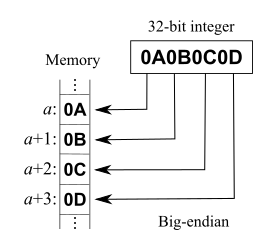

# 第6章 类文件结构

> 2022年10月5日 陕西西安

## 6.2 无关性的基石

* 语言无关性：Java虚拟机上可以支持其他语言运行在JVM上。

* 平台无关性：一次编译，到处运行。

* 字节码：
  1. 是不同JVM和不同平台都统一使用的一种程序存储格式。
  2. Java语言中的各种常量、关键字和运算符号的语义最终都是由多条字节码命令组成的。

## 6.3 Class类文件的结构

* Class文件是一组以8位字节为基础单位的二进制流。

* Big-Endian：是一种字节存储顺序，简称 **高位在前** 或 **大尾序** 或 **大端序**。具体是指最高位字节在地址的最低位，最低位字节在地址最高位，按照这样的顺序来存储数据。

  如下图所示，对于多字节数据，如整数（32位机中一般占4字节），在不同的处理器的存放方式主要有两种，以内存中0x0A0B0C0D的存放方式为例。0x0A是最高字节，他存储在最低的内存地址a处。

  

  关于这个问题可以参考：https://zh.wikipedia.org/wiki/%E5%AD%97%E8%8A%82%E5%BA%8F

* Class文件采用类似C语言结构体的伪结构存储数据，伪结构包含两种数据类型：**无符号数**和**表**。
* 无符号数：基本数据类型，以u1，u2，u4，u8分别来表示1个字节、2个字节、4个字节和8个字节的无符号数。
* 表：由多个无符号数或其他表作为数据项构成的复合数据类型。

### 6.3.1 魔数和Class文件的版本

* 魔数：Class文件的头4个字节称为魔数。
* 魔数的作用：确定这个文件是否为一个能被虚拟机接受的Class文件。
* Class文件的版本号：紧接着魔数后面的4个字节存储的是Class文件的版本号。第5到6个字节是次版本号，第7到8个字节是主版本号。
* Class文件版本号的作用：确定虚拟机是否可以执行该版本号的Class文件，例如一个Class文件的主版本号是0x0032，十进制是50，50对应JDK 1.6.0_01，也就是说这个Class文件可以被1.6.0_01或以上版本的虚拟机执行。

