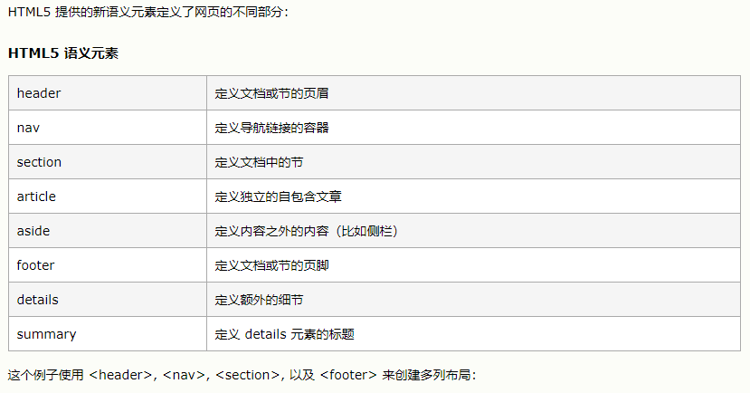

## 2022年4月11日

学习站点：

* [CSS Flexbox](https://www.w3school.com.cn/css/css3_flexbox.asp)
* [w3cSchool](https://www.w3school.com.cn/h.asp)
* [MDN 学习web开发](https://developer.mozilla.org/zh-CN/docs/Learn)
* [MDN CSS排版概述](https://developer.mozilla.org/zh-CN/docs/Web/CSS/CSS_Flexible_Box_Layout/Basic_Concepts_of_Flexbox)

弹性布局中必须有一个 `display `属性设置为 `flex` 的父元素。弹性容器的直接子元素会自动成为弹性项目。以下是关于弹性盒子布局的相关css属性：

* `flex-direction` 属性定义容器要在哪个方向上堆叠 flex 项目。

* `flex-wrap` 属性规定是否应该对 flex 项目换行，`nowrap` 值规定将不对 flex 项目换行（默认）。

* `flex-flow` 属性是用于同时设置 `flex-direction` 和 `flex-wrap` 属性的简写属性。

* `justify-content` 属性用于水平对齐 `flex` 项目。

* `align-items` 属性用于垂直对齐 `flex `项目。

* `align-content`属性设置了浏览器如何沿着[弹性盒子布局](https://developer.mozilla.org/zh-CN/docs/Web/CSS/CSS_Flexible_Box_Layout)的纵轴和[网格布局](https://developer.mozilla.org/zh-CN/docs/Web/CSS/CSS_Grid_Layout)的主轴在内容项之间和周围分配空间。
  * 参考：https://developer.mozilla.org/zh-CN/docs/Web/CSS/align-content

## 2022年4月17日

1. `:nth-of-type()`：[一个css选择器](https://developer.mozilla.org/zh-CN/docs/Web/CSS/:nth-of-type)，用来选择一组兄弟节点中的标签，用 n 来筛选出在一组兄弟节点的位置。

2. 编写了[基础布局训练](https://developer.mozilla.org/zh-CN/docs/Learn/CSS/CSS_layout/Fundamental_Layout_Comprehension)的代码。

3. `Flex` 简写形式允许你把三个数值按这个顺序书写 — `flex-grow`，`flex-shrink`，`flex-basis`

   * `flex-grow`：若被赋值为一个正整数， flex 元素会以 `flex-basis` 为基础，沿主轴方向增长尺寸。这会使该元素延展，并占据此方向轴上的可用空间（available space）。

   * `flex-shrink`：如果我们的容器中没有足够排列flex元素的空间，那么可以把flex元素`flex-shrink`属性设置为正整数来缩小它所占空间到`flex-basis`以下。

   * `flex-basis`：定义了该元素的**空间大小**。

4. `order`：规定了flex项目的顺序

5. `align-self` 属性规定弹性容器内所选项目的对齐方式。`align-self` 属性将覆盖容器的 align-items 属性所设置的默认对齐方式。

## 2022年4月19日

1. 使用 HTML5 的网站布局

   
   
2. box-sizing 

   定义了user_agent如何去计算 应该如何计算一个元素的总宽度和总高度。

   参考文档：https://developer.mozilla.org/zh-CN/docs/Web/CSS/box-sizing

## 2022年4月20日

1. css属性

   * text-decoration

     用于设置文本的修饰线外观的（下划线、上划线、贯穿线/删除线 或 闪烁）。

     参考文档：https://developer.mozilla.org/zh-CN/docs/Web/CSS/text-decoration

   * list-style-type

     设置列表元素的 marker。（比如圆点、符号、或者自定义计数器样式）。

     参考文档：https://developer.mozilla.org/zh-CN/docs/Web/CSS/list-style-type

   * cursor

     设置光标的类型（如果有），在鼠标指针悬停在元素上时显示相应样式。

     参考文档：https://developer.mozilla.org/zh-CN/docs/Web/CSS/cursor

2. `:hover` CSS伪类会在光标（鼠标指针）悬停在元素上时提供关联的样式。

## 2022年4月21日

Material Design Icons：https://material.io/design/iconography/system-icons.html#design-principles

## 2022年4月22日

新学的CSS属性

* box-shadow
* transition
